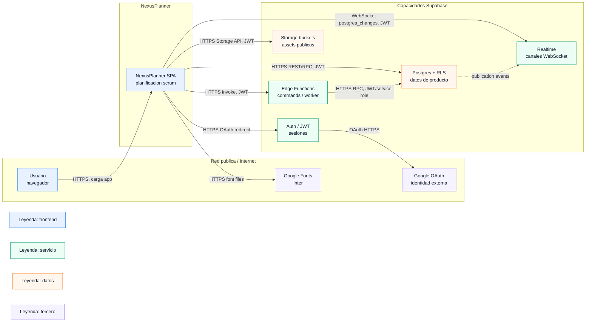
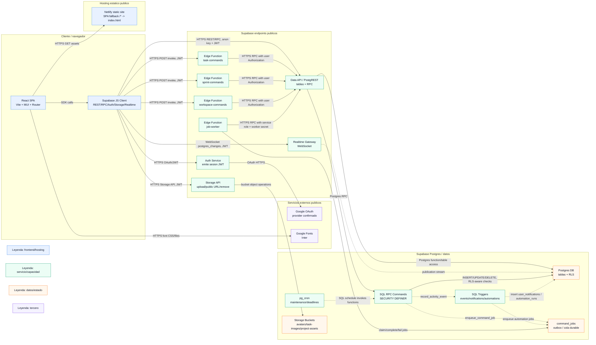
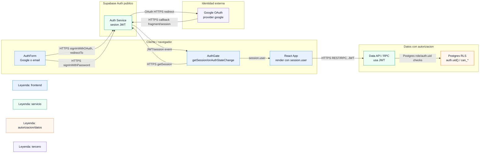
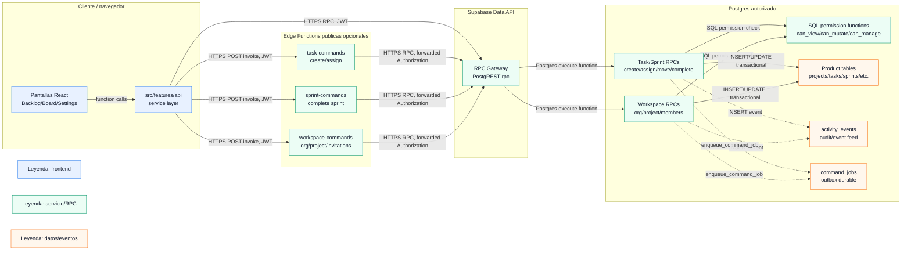
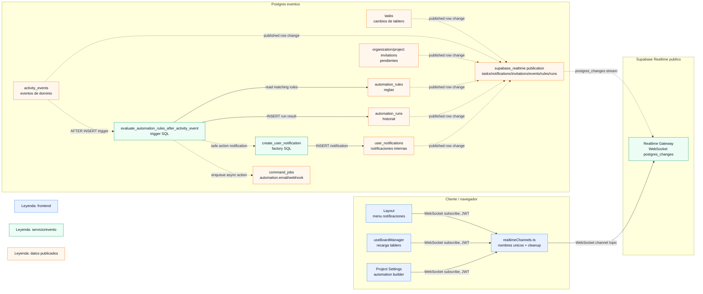
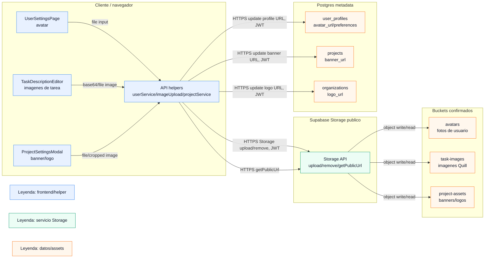
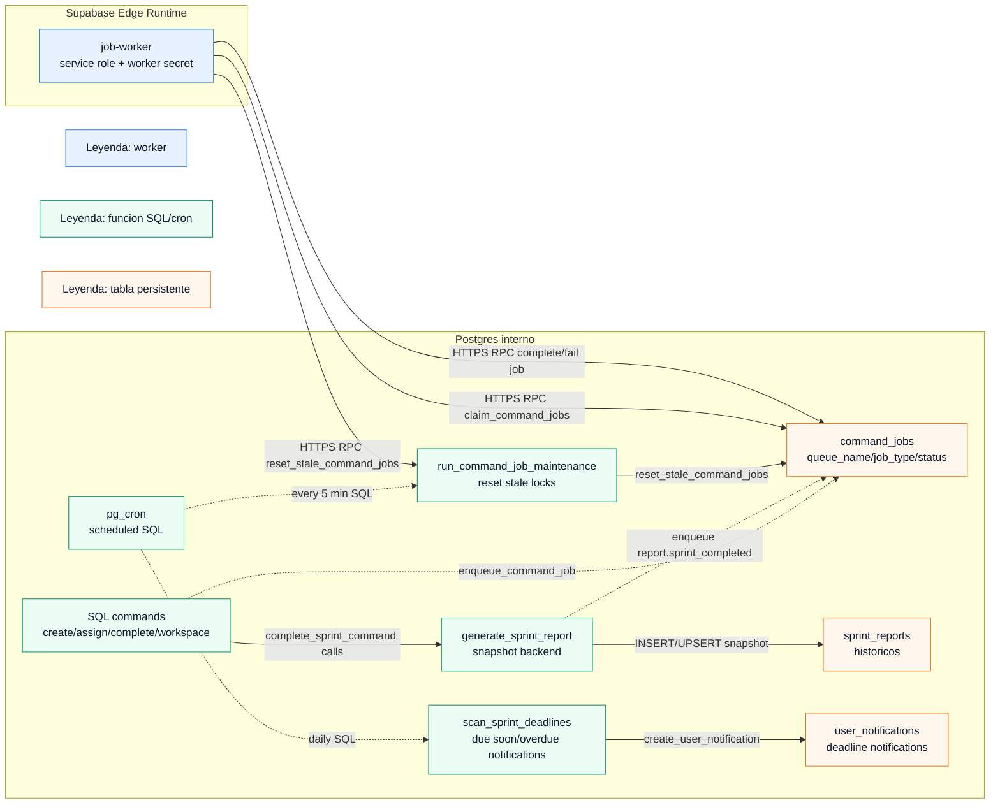
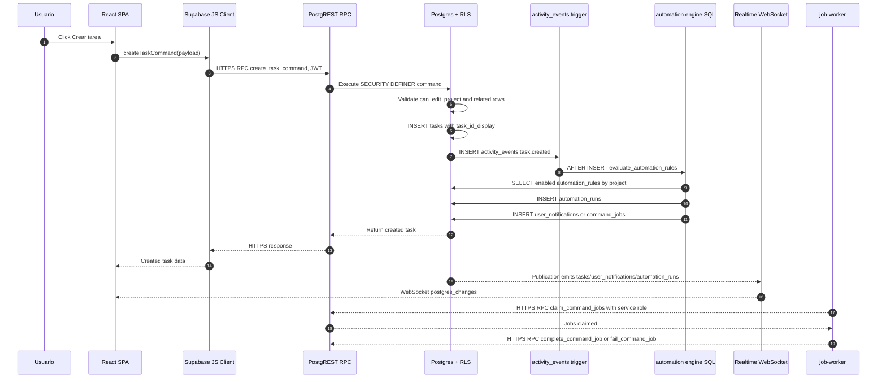
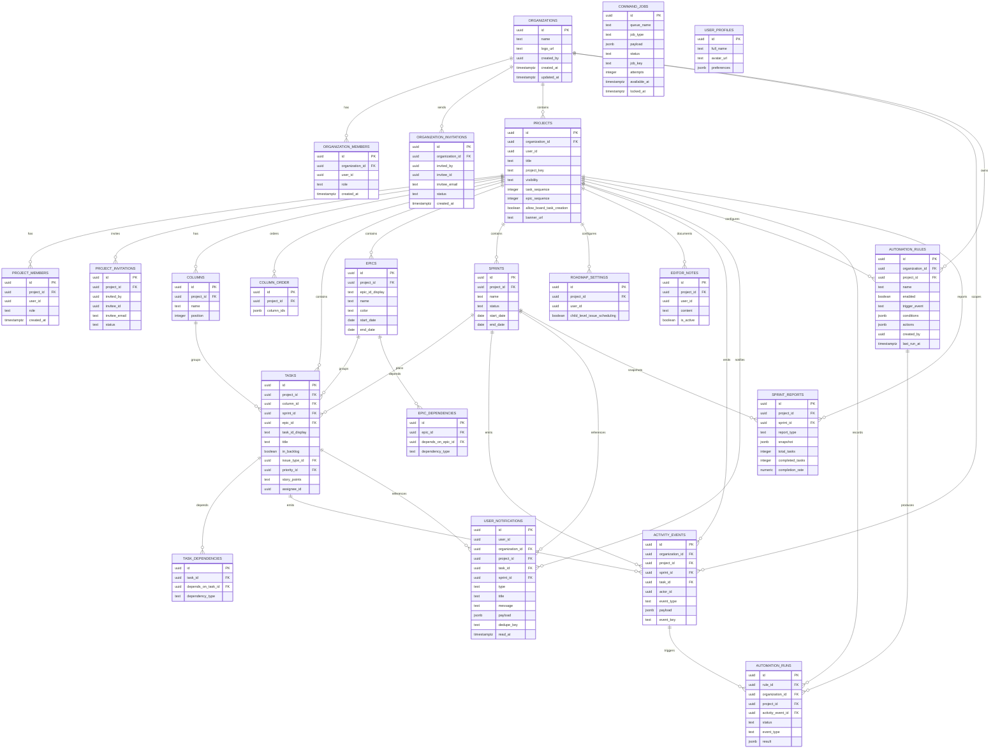

# NexusPlanner System Architecture Mermaid

Diagrams derived from the repository code, migrations, deployment config, SDK clients, environment variables, and Supabase Edge Functions. Provider names are decomposed into capabilities instead of single boxes.

## D1 - Context

## D2 - Containers

## D3 - Auth Domain

## D4 - Product Commands Domain

## D5 - Realtime, Notifications And Automations Domain

## D6 - Storage And Assets Domain

## D7 - Jobs, Cron And Reports Domain

## Df - Critical Data Flow

## De - Data Model

## Unconfirmed

- Payments are not confirmed.
- A real email provider is not confirmed.
- External webhook delivery by the worker is not confirmed.
- Kafka or another external broker is not implemented.
- VPC/private network boundaries are not confirmed.
- Netlify Functions are not confirmed.
- Internal TLS termination inside Netlify or Supabase is not confirmed.
- External Google Console and Supabase dashboard configuration are not confirmed.
