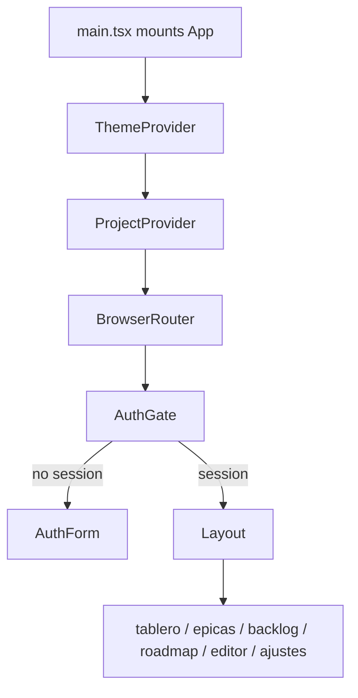

# App Shell

## Propósito

Este módulo compone providers globales, rutas y layout. `App` envuelve toda la aplicación con `ThemeProvider`, `ProjectProvider`, `BrowserRouter` y `AuthGate`, y solo renderiza rutas cuando `AuthGate` entrega una `Session` (`src/app/App.tsx:18`, `src/app/App.tsx:19`, `src/app/App.tsx:20`, `src/app/App.tsx:21`).

## Modelo de datos

No define tablas. Consume `Session` de Supabase en `AuthGate` y pasa `session.user.id` a Tablero, Backlog, Roadmap, Editor y Ajustes (`src/app/App.tsx:39`, `src/app/App.tsx:64`, `src/app/App.tsx:69`, `src/app/App.tsx:85`, `src/app/App.tsx:95`).

## Ciclo de vida de las entidades

No aplica para entidades persistidas. El ciclo de vida de UI es: `ThemeProvider` y `ProjectProvider` se montan antes del router, `AuthGate` verifica sesión, y luego `Layout` hospeda las rutas hijas (`src/app/App.tsx:18`, `src/app/App.tsx:24`).

## Autorización

La autorización de entrada es sesión o login: si `AuthGate` no tiene sesión muestra `AuthForm`; si hay sesión renderiza hijos (`src/features/auth/AuthGate.tsx:60`, `src/features/auth/AuthGate.tsx:71`). Las autorizaciones de dominio quedan en servicios, RLS y checks de `can_edit`, no en `App`.

## Flujos principales

Las rutas verificadas son `/` redirigiendo a `/tablero`, `/tablero`, `/epicas`, `/backlog`, `/roadmap`, `/editor`, `/ajustes` y wildcard a `/tablero` (`src/app/App.tsx:25`, `src/app/App.tsx:28`, `src/app/App.tsx:58`, `src/app/App.tsx:63`, `src/app/App.tsx:68`, `src/app/App.tsx:73`, `src/app/App.tsx:92`, `src/app/App.tsx:102`).

## Contratos externos

Expone rutas React Router. Consume `getProviderAvatarUrl(session.user)` para pasar avatar de proveedor al layout y ajustes (`src/app/App.tsx:24`, `src/app/App.tsx:97`).

## Errores y casos borde

No hay error boundary en `App`. Las rutas desconocidas redirigen a `/tablero` (`src/app/App.tsx:102`).

## Trampas

`ProjectProvider` está fuera de `BrowserRouter` y de `AuthGate`, así que cualquier cambio que suponga navegación dentro del provider debe revisar esta composición (`src/app/App.tsx:18`). `BoardInfo` se renderiza como header de `Board` desde la ruta, no dentro de `Board` exclusivamente (`src/app/App.tsx:41`, `src/app/App.tsx:49`).

## Preguntas abiertas

No se verificó en esta fase si `src/main.tsx` añade wrappers adicionales además de montar `App`.
