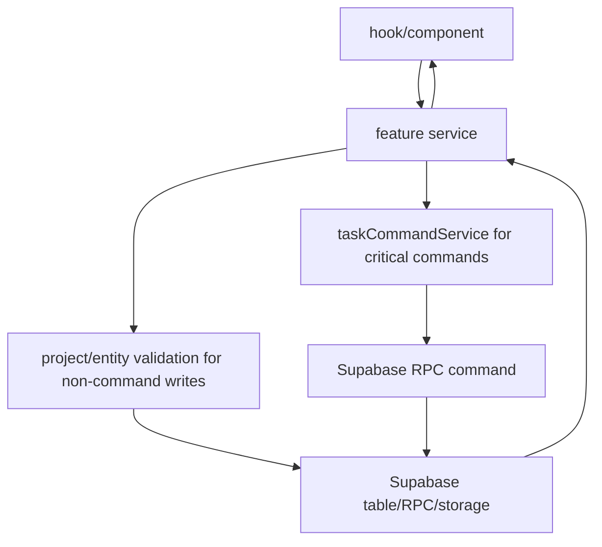

# API Services

## Propósito

`src/features/api` es la frontera de acceso a Supabase para datos de producto. Los componentes y hooks importan funciones de servicios como `backlogService`, `boardService`, `projectService`, `organizationService`, `sprintService`, `epicService`, `dependencyService`, `editorService`, `notificationService`, `catalogService` y `userService` (`src/features/backlog/hooks/useBacklogTable.ts:3`, `src/features/board/hooks/useBoardManager.ts:6`, `src/features/projects/hooks/useProjects.ts:1`).

## Modelo de datos

Los tipos principales están en servicios: `Project`, `ProjectWithTags` y `ProjectMemberWithProfile` (`src/features/api/projectService.ts:4`, `src/features/api/projectService.ts:27`, `src/features/api/projectService.ts:33`), `Organization`, `OrganizationMemberWithProfile` y `OrganizationInvitation` (`src/features/api/organizationService.ts:13`, `src/features/api/organizationService.ts:23`, `src/features/api/organizationService.ts:51`), `BacklogTask` (`src/features/api/backlogService.ts:3`), `SprintTaskRecord` (`src/features/api/sprintService.ts:45`), `Epic` y `RoadmapTask` (`src/features/api/epicService.ts:10`, `src/features/api/epicService.ts:26`), `EpicDependency` y `TaskDependency` (`src/features/api/dependencyService.ts:3`, `src/features/api/dependencyService.ts:12`). Los command payloads críticos viven en `taskCommandService` y `workspaceCommandService`: `CreateTaskCommandInput`, `AssignTaskCommandInput`, `CompleteSprintTaskDisposition` y `CreateProjectCommandInput` (`src/features/api/taskCommandService.ts:6`, `src/features/api/taskCommandService.ts:23`, `src/features/api/taskCommandService.ts:29`, `src/features/api/workspaceCommandService.ts:18`). `automationService` define `AutomationRule`, `AutomationRun`, condiciones y acciones para configurar reglas server-side, no para ejecutarlas en el cliente (`src/features/api/automationService.ts:3`, `src/features/api/automationService.ts:16`, `src/features/api/automationService.ts:23`, `src/features/api/automationService.ts:29`, `src/features/api/automationService.ts:45`).

## Ciclo de vida de las entidades

La creación de proyecto llama `createProjectCommand`, que ejecuta RPC `create_project_command`; ya no existe fallback frontend de inserts parciales (`src/features/api/projectService.ts:158`, `src/features/api/workspaceCommandService.ts:43`, `supabase/migrations/20260730033038_workspace_transaction_commands.sql:54`). La creación de organización usa `createOrganizationCommand`; invitaciones, aceptación/rechazo y cambios de miembros de organización/proyecto usan `workspaceCommandService` en vez de inserts/update/delete directos (`src/features/api/organizationService.ts:143`, `src/features/api/organizationService.ts:256`, `src/features/api/organizationService.ts:271`, `src/features/api/projectInvitationService.ts:58`, `src/features/api/projectService.ts:357`, `src/features/api/workspaceCommandService.ts:28`). Crear tarea llama `createTaskCommand` desde backlog y board; el board pasa también `sprint_id` cuando crea una tarea dentro del sprint activo (`src/features/api/backlogService.ts:174`, `src/features/api/boardService.ts:292`, `src/features/board/hooks/useBoardManager.ts:332`). Asignar responsable se separa del update genérico y llama `assignTaskCommand` cuando el payload incluye `assignee_id`; cambiar estado/columna desde el editor llama `moveTaskColumnCommand` cuando el payload incluye `column_id` y la tarea no va al backlog (`src/features/api/backlogService.ts:213`, `src/features/api/backlogService.ts:233`, `src/features/api/boardService.ts:330`, `src/features/api/boardService.ts:331`, `src/features/api/boardService.ts:378`). Crear épica llama `create_epic_command`, que actualiza `projects.epic_sequence`, genera `epic_id_display`, valida `can_mutate_project`, valida owner de proyecto y registra actividad/outbox (`src/features/api/epicService.ts:178`, `src/features/api/epicService.ts:196`, `supabase/migrations/20260831195943_cli_missing_backend_commands.sql:1`). Crear sprint llama `create_sprint_command`, que calcula `end_date` server-side desde `p_duration` (`7d`, `15d`, `1m`), valida un solo sprint activo si se crea como `active`, registra actividad/outbox y evita duraciones arbitrarias desde el cliente (`src/features/api/sprintService.ts:111`, `src/features/api/sprintService.ts:119`, `supabase/migrations/20260831195943_cli_missing_backend_commands.sql:133`). Completar sprint llama `completeSprintCommand`, tanto para cierre sin incompletas como para cierre con disposiciones por tarea (`src/features/api/sprintService.ts:184`, `src/features/api/sprintService.ts:391`). Iniciar sprint solo actualiza de `future` a `active` si no hay otro activo (`src/features/api/sprintService.ts:153`, `src/features/api/sprintService.ts:166`, `src/features/api/sprintService.ts:174`).

## Autorización

La capa de servicio hace checks explícitos de pertenencia además de RLS. Sprints validan `project_id` por `assertSprintBelongsToProject` (`src/features/api/sprintService.ts:4`). Backlog valida que columnas, sprints y épicas pertenezcan al proyecto antes de mover o enlazar (`src/features/api/backlogService.ts:70`, `src/features/api/backlogService.ts:254`, `src/features/api/backlogService.ts:297`). Dependencias validan que ambos extremos compartan proyecto y que la dependencia pertenezca al proyecto antes de borrar (`src/features/api/dependencyService.ts:80`, `src/features/api/dependencyService.ts:98`, `src/features/api/dependencyService.ts:174`, `src/features/api/dependencyService.ts:196`). Las dependencias de tareas se leen por chunks para evitar URLs demasiado largas en PostgREST cuando hay muchos IDs en roadmap (`src/features/api/dependencyService.ts:20`, `src/features/api/dependencyService.ts:50`).

Los checks de permisos de los commands críticos se evalúan también en Supabase. `can_edit_project` se conserva como wrapper de compatibilidad, pero nuevas reglas deben depender de la capa canónica `can_mutate_project`, `can_manage_project`, `can_manage_organization`, `can_add_project_member`, `can_invite_to_organization`, `can_invite_to_project` y `can_assign_project_user` en vez de duplicar lógica en servicios frontend (`supabase/migrations/20260729215527_critical_task_sprint_commands.sql:50`, `supabase/migrations/20260729215527_critical_task_sprint_commands.sql:158`, `supabase/migrations/20260729215527_critical_task_sprint_commands.sql:338`, `supabase/migrations/20260729215527_critical_task_sprint_commands.sql:449`, `supabase/migrations/20260730034117_centralized_sql_permissions.sql:80`, `supabase/migrations/20260730034117_centralized_sql_permissions.sql:90`, `supabase/migrations/20260730034117_centralized_sql_permissions.sql:39`, `supabase/migrations/20260730034117_centralized_sql_permissions.sql:100`, `supabase/migrations/20260730034117_centralized_sql_permissions.sql:130`, `supabase/migrations/20260730034117_centralized_sql_permissions.sql:140`, `supabase/migrations/20260730034117_centralized_sql_permissions.sql:153`, `supabase/migrations/20260730034117_centralized_sql_permissions.sql:212`). La exposición RPC se limita por grants: `anon` no debe ejecutar estos commands, `authenticated` sí, y `enqueue_command_job` no se concede al cliente (`supabase/migrations/20260729215934_harden_command_rpc_privileges.sql:4`, `supabase/migrations/20260729215934_harden_command_rpc_privileges.sql:6`, `supabase/migrations/20260729215934_harden_command_rpc_privileges.sql:9`, `supabase/migrations/20260729215934_harden_command_rpc_privileges.sql:12`).

Los servicios frontend y Edge wrappers no deben escribir `activity_events`. Los commands SQL nuevos deben llamar `record_activity_event`, que queda sin permiso de ejecución para `anon`/`authenticated`; el trigger `normalize_activity_event_before_insert` valida también inserts heredados que todavía ocurren dentro de commands existentes (`supabase/migrations/20260730035602_centralize_activity_events.sql:14`, `supabase/migrations/20260730035602_centralize_activity_events.sql:128`, `supabase/migrations/20260730035602_centralize_activity_events.sql:134`, `supabase/migrations/20260730035602_centralize_activity_events.sql:183`).

## Flujos principales

## Contratos externos

La API externa real es Supabase REST/RPC/Realtime/Storage. Los servicios llaman tablas con `.from(...)`, RPCs como `create_project_command`, `create_organization_command`, `create_organization_invitation_command`, `add_project_member_command`, `create_epic_command`, `create_sprint_command`, `create_task_command`, `assign_task_command`, `move_task_column_command`, `schedule_task_command`, `complete_sprint_command`, y canales realtime en servicios de notificación/invitación (`src/features/api/workspaceCommandService.ts:33`, `src/features/api/workspaceCommandService.ts:47`, `src/features/api/workspaceCommandService.ts:63`, `src/features/api/workspaceCommandService.ts:142`, `src/features/api/epicService.ts:196`, `src/features/api/sprintService.ts:119`, `src/features/api/taskCommandService.ts:46`, `src/features/api/taskCommandService.ts:72`, `src/features/api/taskCommandService.ts:87`, `src/features/api/taskCommandService.ts:103`, `src/features/api/notificationService.ts:58`, `src/features/api/projectInvitationService.ts:120`, `supabase/migrations/20260831195943_cli_missing_backend_commands.sql:285`). Los wrappers Edge `epic-commands`, `task-commands`, `sprint-commands`, `notification-commands`, `workspace-commands` y `agent-commands` son contratos HTTP server-side encima de esas RPCs, no una segunda copia de reglas (`supabase/functions/epic-commands/index.ts:42`, `supabase/functions/task-commands/index.ts:34`, `supabase/functions/sprint-commands/index.ts:36`, `supabase/functions/notification-commands/index.ts:42`, `supabase/functions/workspace-commands/index.ts:70`, `supabase/functions/agent-commands/index.ts:301`). `agent-commands` solo orquesta planes JSON de agentes: valida `organization -> projects -> sprints/epics/tasks`, crea entidades con commands server-side y resuelve referencias locales como `epic_ref` o `sprint_ref` a IDs reales (`supabase/functions/agent-commands/index.ts:39`, `supabase/functions/agent-commands/index.ts:144`, `supabase/functions/agent-commands/index.ts:176`, `supabase/functions/agent-commands/index.ts:212`, `supabase/functions/agent-commands/index.ts:245`). `activity_events` puede alimentar realtime/feed después, pero su escritura pertenece a SQL commands y a `record_activity_event`, no a servicios frontend (`supabase/migrations/20260729215527_critical_task_sprint_commands.sql:653`, `supabase/migrations/20260730035602_centralize_activity_events.sql:134`, `supabase/migrations/20260730042301_move_task_column_command.sql:89`, `supabase/migrations/20260831195943_cli_missing_backend_commands.sql:85`, `supabase/migrations/20260831195943_cli_missing_backend_commands.sql:212`, `supabase/migrations/20260831195943_cli_missing_backend_commands.sql:340`). `user_notifications` también es server-side: `notificationService` solo lee, marca leídas y se suscribe; nuevas notificaciones nacen por `create_user_notification` y triggers SQL, y borrar todo marca leídas por `mark_all_notifications_read_command` (`src/features/api/notificationService.ts:24`, `src/features/api/notificationService.ts:41`, `src/features/api/notificationService.ts:58`, `supabase/migrations/20260730041047_server_side_notifications.sql:36`, `supabase/migrations/20260730041047_server_side_notifications.sql:198`, `supabase/migrations/20260730041047_server_side_notifications.sql:229`, `supabase/migrations/20260730041047_server_side_notifications.sql:272`, `supabase/migrations/20260730041047_server_side_notifications.sql:315`, `supabase/migrations/20260831195943_cli_missing_backend_commands.sql:256`). Los servicios que exponen suscripciones deben nombrar canales mediante `createRealtimeChannelName` para no reutilizar tópicos vivos en React (`src/shared/realtime/realtimeChannels.ts:22`).

Emails, reportes y procesamiento asíncrono salen por la cola server-side, no por servicios frontend. Los servicios pueden disparar commands que terminen en `enqueue_command_job`, pero no deben invocar `claim_command_jobs`, `complete_command_job`, `fail_command_job` ni `reset_stale_command_jobs`; esos RPCs pertenecen a `supabase/functions/job-worker` con service role (`supabase/migrations/20260730045659_command_job_worker_foundation.sql:24`, `supabase/migrations/20260730045659_command_job_worker_foundation.sql:73`, `supabase/migrations/20260730045659_command_job_worker_foundation.sql:118`, `supabase/migrations/20260730045659_command_job_worker_foundation.sql:158`, `supabase/migrations/20260730045659_command_job_worker_foundation.sql:200`, `supabase/functions/job-worker/index.ts:68`, `supabase/functions/job-worker/index.ts:87`). Si se reemplaza el transporte por un broker Kafka-compatible self-hosted, los servicios frontend no deben cambiar: seguirá siendo command -> outbox/evento -> worker.

`notificationService` reconoce notificaciones de deadline de sprint solo como datos leídos desde `user_notifications`; los tipos `sprint_due_soon` y `sprint_overdue` vienen de `scan_sprint_deadlines` y se aceptan en la allowlist SQL de `create_user_notification` (`src/features/api/notificationService.ts:16`, `src/features/api/notificationService.ts:17`, `supabase/migrations/20260730053934_scheduled_maintenance_cron.sql:45`, `supabase/migrations/20260730053934_scheduled_maintenance_cron.sql:80`, `supabase/migrations/20260730053934_scheduled_maintenance_cron.sql:123`, `supabase/migrations/20260730054111_allow_sprint_deadline_notification_types.sql:42`). Ningún servicio API debe ejecutar `scan_sprint_deadlines` o `run_command_job_maintenance`; esos RPCs pertenecen a cron y quedaron revocados para `authenticated` (`supabase/migrations/20260730053934_scheduled_maintenance_cron.sql:41`, `supabase/migrations/20260730053934_scheduled_maintenance_cron.sql:155`).

`reportService` es lectura de snapshots, no motor de métricas. `fetchProjectSprintReports` y `fetchSprintReport` consultan `sprint_reports`; los campos numéricos ya vienen calculados por SQL y el `snapshot` trae tareas/status/disposiciones capturados al cerrar sprint (`src/features/api/reportService.ts:39`, `src/features/api/reportService.ts:96`, `src/features/api/reportService.ts:107`, `supabase/migrations/20260730052854_backend_sprint_reports.sql:1`, `supabase/migrations/20260730052854_backend_sprint_reports.sql:301`). No uses este servicio para recalcular burndown/velocity desde `tasks`; esos cálculos deben agregarse como nuevos snapshots o funciones backend.

`automationService` es CRUD de configuración e historial. `fetchAutomationRules` lee reglas por `project_id`, `fetchAutomationRuns` lee ejecuciones recientes por proyecto/regla, `createAutomationRule` inserta una regla y `updateAutomationRule`/`deleteAutomationRule` modifican la configuración (`src/features/api/automationService.ts:79`, `src/features/api/automationService.ts:92`, `src/features/api/automationService.ts:112`, `src/features/api/automationService.ts:125`, `src/features/api/automationService.ts:140`). La ejecución ocurre por el trigger SQL sobre `activity_events`, así que ningún servicio frontend debe simular `when/if/then` ni escribir `automation_runs` (`supabase/migrations/20260730055853_premium_automation_rules.sql:347`, `supabase/migrations/20260730055853_premium_automation_rules.sql:462`). `notificationService` acepta el tipo `automation_rule` porque las acciones de automatización crean notificaciones server-side (`src/features/api/notificationService.ts:18`, `supabase/migrations/20260730055853_premium_automation_rules.sql:271`, `supabase/migrations/20260730055853_premium_automation_rules.sql:299`).

## Errores y casos borde

Los servicios lanzan errores hacia hooks. Algunos convierten errores únicos en mensajes de dominio, por ejemplo miembro duplicado en proyecto (`src/features/api/projectService.ts:524`). `deleteProject` exige que Supabase devuelva al menos una fila borrada (`src/features/api/projectService.ts:423`, `src/features/api/projectService.ts:432`).

## Trampas

No metas acceso directo a Supabase en UI para datos de producto si ya existe servicio. No quites validaciones de proyecto de servicios: RLS puede bloquear, pero los errores de dominio actuales también previenen mezcla visual antes de llegar a la base (`src/features/api/dependencyService.ts:91`, `src/features/api/backlogService.ts:82`).

No reimplementes `create_task`, `assign_task`, `move_task_column`, `schedule_task`, `create_epic`, `create_sprint`, `mark_all_notifications_read` ni `complete_sprint` con escrituras directas desde servicios nuevos. Si una pantalla necesita esas acciones, usa los command services/RPC existentes para conservar eventos, notificaciones, IDs visibles, cola/outbox, movimiento persistente de estado, fechas persistentes para calendario/timeline y cierre transaccional (`src/features/api/taskCommandService.ts:46`, `src/features/api/taskCommandService.ts:72`, `src/features/api/taskCommandService.ts:87`, `src/features/api/taskCommandService.ts:103`, `supabase/functions/task-commands/index.ts:64`, `src/features/api/epicService.ts:196`, `src/features/api/sprintService.ts:119`, `src/features/api/notificationService.ts:58`).

No agregues un servicio que ejecute automatizaciones desde React. Las automatizaciones dependen de `activity_events` y de `execute_automation_action`; el cliente solo configura `automation_rules` y lee `automation_runs` (`src/features/api/automationService.ts:83`, `src/features/api/automationService.ts:97`, `supabase/migrations/20260730055853_premium_automation_rules.sql:239`, `supabase/migrations/20260730055853_premium_automation_rules.sql:347`).

## Preguntas abiertas

No se verificó si todos los accesos directos restantes a `supabase` fuera de `src/features/api` son intencionales; `ThemeContext`, `Layout`, `useBoardManager` y `imageUpload` lo usan directamente (`src/app/ThemeContext.tsx:78`, `src/app/Layout.tsx:246`, `src/features/board/hooks/useBoardManager.ts:170`, `src/lib/imageUpload.ts:9`).
