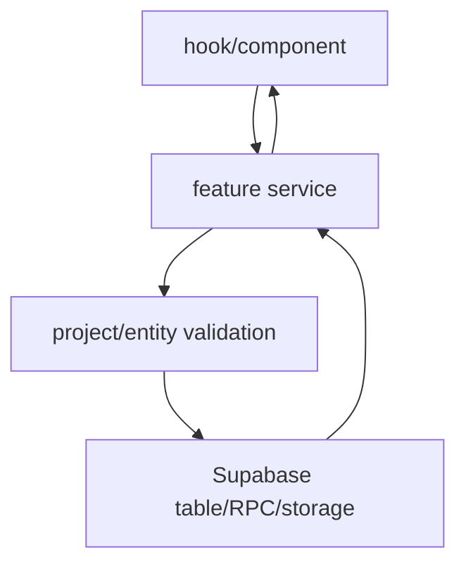

# API Services

## Propósito

`src/features/api` es la frontera de acceso a Supabase para datos de producto. Los componentes y hooks importan funciones de servicios como `backlogService`, `boardService`, `projectService`, `organizationService`, `sprintService`, `epicService`, `dependencyService`, `editorService`, `notificationService`, `catalogService` y `userService` (`src/features/backlog/hooks/useBacklogTable.ts:3`, `src/features/board/hooks/useBoardManager.ts:6`, `src/features/projects/hooks/useProjects.ts:1`).

## Modelo de datos

Los tipos principales están en servicios: `Project`, `ProjectWithTags` y `ProjectMemberWithProfile` (`src/features/api/projectService.ts:4`, `src/features/api/projectService.ts:27`, `src/features/api/projectService.ts:33`), `Organization`, `OrganizationMemberWithProfile` y `OrganizationInvitation` (`src/features/api/organizationService.ts:3`, `src/features/api/organizationService.ts:13`, `src/features/api/organizationService.ts:41`), `BacklogTask` (`src/features/api/backlogService.ts:3`), `SprintTaskRecord` (`src/features/api/sprintService.ts:45`), `Epic` y `RoadmapTask` (`src/features/api/epicService.ts:10`, `src/features/api/epicService.ts:26`), `EpicDependency` y `TaskDependency` (`src/features/api/dependencyService.ts:3`, `src/features/api/dependencyService.ts:12`).

## Ciclo de vida de las entidades

La creación de proyecto intenta RPC `create_project_with_defaults`; si la RPC falta, usa fallback con rollback que borra el proyecto parcial ante error (`src/features/api/projectService.ts:307`, `src/features/api/projectService.ts:318`, `src/features/api/projectService.ts:319`, `src/features/api/projectService.ts:113`, `src/features/api/projectService.ts:186`). La creación de organización usa RPC `create_organization_with_owner` (`src/features/api/organizationService.ts:124`, `src/features/api/organizationService.ts:134`). La creación de sprint inserta estado `future`, `start_date` y `end_date`; iniciar sprint solo actualiza de `future` a `active` si no hay otro activo (`src/features/api/sprintService.ts:113`, `src/features/api/sprintService.ts:119`, `src/features/api/sprintService.ts:153`, `src/features/api/sprintService.ts:166`, `src/features/api/sprintService.ts:174`).

## Autorización

La capa de servicio hace checks explícitos de pertenencia además de RLS. Sprints validan `project_id` por `assertSprintBelongsToProject` (`src/features/api/sprintService.ts:4`). Backlog valida que columnas, sprints y épicas pertenezcan al proyecto antes de mover o enlazar (`src/features/api/backlogService.ts:70`, `src/features/api/backlogService.ts:254`, `src/features/api/backlogService.ts:297`). Dependencias validan que ambos extremos compartan proyecto y que la dependencia pertenezca al proyecto antes de borrar (`src/features/api/dependencyService.ts:80`, `src/features/api/dependencyService.ts:98`, `src/features/api/dependencyService.ts:174`, `src/features/api/dependencyService.ts:196`).

## Flujos principales

## Contratos externos

La API externa real es Supabase REST/RPC/Realtime/Storage. Los servicios llaman tablas con `.from(...)`, RPCs como `create_project_with_defaults`, `create_organization_with_owner`, `accept_organization_invitation`, y canales realtime en servicios de notificación/invitación (`src/features/api/projectService.ts:308`, `src/features/api/organizationService.ts:135`, `src/features/api/organizationService.ts:350`, `src/features/api/notificationService.ts:48`).

## Errores y casos borde

Los servicios lanzan errores hacia hooks. Algunos convierten errores únicos en mensajes de dominio, por ejemplo miembro duplicado en proyecto (`src/features/api/projectService.ts:524`). `deleteProject` exige que Supabase devuelva al menos una fila borrada (`src/features/api/projectService.ts:423`, `src/features/api/projectService.ts:432`).

## Trampas

No metas acceso directo a Supabase en UI para datos de producto si ya existe servicio. No quites validaciones de proyecto de servicios: RLS puede bloquear, pero los errores de dominio actuales también previenen mezcla visual antes de llegar a la base (`src/features/api/dependencyService.ts:91`, `src/features/api/backlogService.ts:82`).

## Preguntas abiertas

No se verificó si todos los accesos directos restantes a `supabase` fuera de `src/features/api` son intencionales; `ThemeContext`, `Layout`, `useBoardManager` y `imageUpload` lo usan directamente (`src/app/ThemeContext.tsx:78`, `src/app/Layout.tsx:231`, `src/features/board/hooks/useBoardManager.ts:162`, `src/lib/imageUpload.ts:9`).
