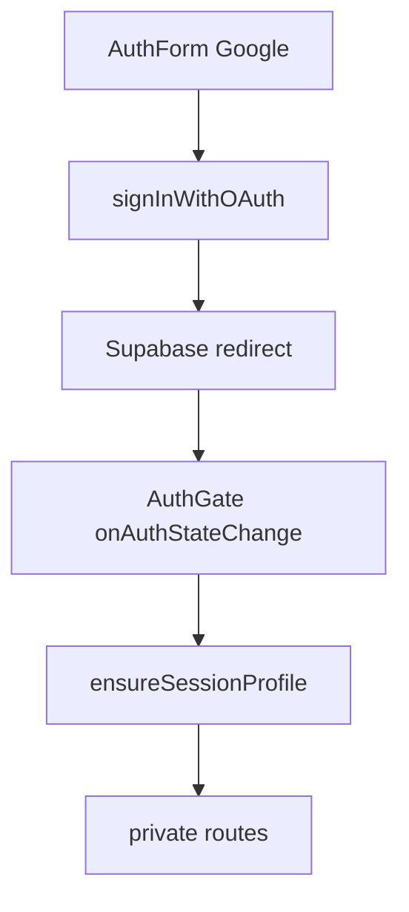

# Auth

## Propósito

Auth decide si la app muestra login o rutas privadas. `AuthGate` obtiene sesión de Supabase, asegura perfil de usuario y entrega la `Session` a los hijos (`src/features/auth/AuthGate.tsx:21`, `src/features/auth/AuthGate.tsx:29`, `src/features/auth/AuthGate.tsx:71`).

## Modelo de datos

No define tablas. Usa `user_profiles` indirectamente porque `AuthGate` llama `ensureSessionProfile(next)` cada vez que aplica sesión (`src/features/auth/AuthGate.tsx:7`, `src/features/auth/AuthGate.tsx:22`).

## Ciclo de vida de las entidades

Al montar, `AuthGate` registra `supabase.auth.onAuthStateChange`, carga `getSession`, llama `ensureSessionProfile`, actualiza estado y desuscribe al desmontar (`src/features/auth/AuthGate.tsx:39`, `src/features/auth/AuthGate.tsx:43`, `src/features/auth/AuthGate.tsx:45`, `src/features/auth/AuthGate.tsx:47`).

## Autorización

La frontera de autorización UI es sesión presente. Sin sesión se renderiza `AuthForm`; con sesión se renderizan los hijos (`src/features/auth/AuthGate.tsx:60`, `src/features/auth/AuthGate.tsx:71`).

## Flujos principales

Google OAuth llama `supabase.auth.signInWithOAuth` con provider `google` y `redirectTo: getAuthRedirectUrl()` (`src/features/auth/AuthForm.tsx:33`, `src/features/auth/AuthForm.tsx:34`, `src/features/auth/AuthForm.tsx:36`). Email/password existe como modo alterno y llama `signInWithPassword` (`src/features/auth/AuthForm.tsx:56`, `src/features/auth/AuthForm.tsx:61`). `getAuthRedirectUrl` prefiere `VITE_AUTH_REDIRECT_URL` y cae a `window.location.origin` (`src/features/auth/authRedirect.ts:4`, `src/features/auth/authRedirect.ts:10`).

## Contratos externos

Expone `AuthForm` y `AuthGate`. Consume `supabase.auth` y `getAuthRedirectUrl` (`src/features/auth/AuthForm.tsx:12`, `src/features/auth/AuthForm.tsx:13`).

## Errores y casos borde

Errores de carga de sesión se loguean con `logError("auth.loadSession", error)` y no bloquean la transición a no sesión (`src/features/auth/AuthGate.tsx:30`, `src/features/auth/AuthGate.tsx:31`). Errores de login se muestran en `Alert` (`src/features/auth/AuthForm.tsx:45`, `src/features/auth/AuthForm.tsx:147`).

## Trampas

No dependas del Site URL de Supabase para OAuth: el código pasa `redirectTo` explícitamente (`src/features/auth/AuthForm.tsx:35`). `AuthForm` dice “Usa tu cuenta de Google” aunque tenga modo email alterno (`src/features/auth/AuthForm.tsx:89`, `src/features/auth/AuthForm.tsx:160`).

## Preguntas abiertas

No se verificó si email/password está habilitado en el proyecto Supabase remoto.
