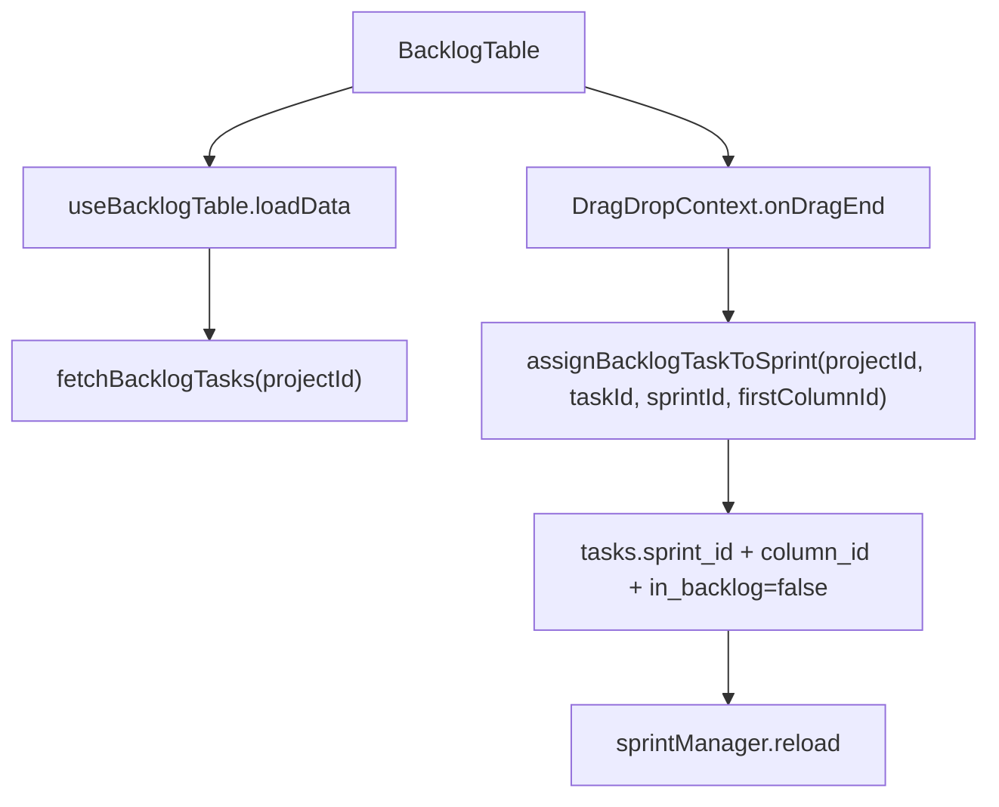

# Backlog

## Propósito

Backlog muestra tareas pendientes de planificación y permite arrastrarlas a sprints. La ruta `/backlog` monta `BacklogTable` con `userId` (`src/app/App.tsx:62`, `src/app/App.tsx:64`).

## Modelo de datos

`BacklogTask` incluye proyecto, título, subtítulo, descripción, asignación, prioridad, story points, parent, épica, tipo, display id, GitHub link, fechas planeadas, posición y timestamps (`src/features/api/backlogService.ts:3`). Backlog filtra tareas por `project_id` e `in_backlog = true` (`src/features/api/backlogService.ts:104`).

## Ciclo de vida de las entidades

La pantalla carga tareas, proyectos, prioridades y sistema de puntos en `loadData` (`src/features/backlog/hooks/useBacklogTable.ts:141`). Crear tarea abre `TaskEditorModal` desde `handleAddTask`; el servicio `createBacklogTask` inserta en `tasks` con `in_backlog: true`, `column_id: null` y `position: 0` (`src/features/api/backlogService.ts:154`, `src/features/api/backlogService.ts:174`, `src/features/api/backlogService.ts:187`). Mover al tablero/sprint actualiza `in_backlog`, `column_id` y `sprint_id` según flujo (`src/features/api/backlogService.ts:264`, `src/features/api/backlogService.ts:309`).

## Autorización

La UI usa `canEditProject` para deshabilitar crear, editar, eliminar y drag a sprint (`src/features/backlog/hooks/useBacklogTable.ts:17`, `src/features/backlog/hooks/useBacklogTable.ts:199`, `src/features/backlog/hooks/useBacklogTable.ts:278`, `src/features/backlog/hooks/useBacklogTable.ts:424`). El servicio valida épica, columna y sprint contra el proyecto activo antes de mutar (`src/features/api/backlogService.ts:70`, `src/features/api/backlogService.ts:254`, `src/features/api/backlogService.ts:297`).

## Flujos principales

La UI divide sprints en activos, futuros y cerrados por `status` (`src/features/backlog/components/BacklogTable/BacklogTable.tsx:62`, `src/features/backlog/components/BacklogTable/BacklogTable.tsx:63`, `src/features/backlog/components/BacklogTable/BacklogTable.tsx:64`).

## Contratos externos

Consume `useSprintManager`, `CreateSprintModal`, `SprintDropZone`, `TaskEditorModal`, `WorkTableToolbar` y menus de tabla (`src/features/backlog/components/BacklogTable/BacklogTable.tsx:40`, `src/features/backlog/components/BacklogTable/BacklogTable.tsx:32`, `src/features/backlog/components/BacklogTable/BacklogTable.tsx:42`).

## Errores y casos borde

Si no hay primera columna del proyecto, drag a sprint falla con mensaje “No se encontró una columna TO DO en el proyecto” (`src/features/backlog/hooks/useBacklogTable.ts:452`). Si se intenta asignar una épica como tarea, se muestra warning y no asigna sprint (`src/features/backlog/hooks/useBacklogTable.ts:439`).

## Trampas

El backlog calcula capacidad sugerida con sprints cerrados y story points, pero no cambia puntos automáticamente; usa `getSprintDurationDays` y tareas del sprint (`src/features/backlog/components/BacklogTable/BacklogTable.tsx:74`, `src/features/backlog/components/BacklogTable/BacklogTable.tsx:89`). No elimines `firstColumnId`: es necesario para convertir backlog a tablero al asignar sprint (`src/features/backlog/hooks/useBacklogTable.ts:91`, `src/features/api/backlogService.ts:309`).

## Preguntas abiertas

El schema base de `tasks.in_backlog` no está en migraciones locales; se verifica por servicios que lo leen/escriben (`src/features/api/backlogService.ts:104`, `src/features/api/backlogService.ts:187`).
