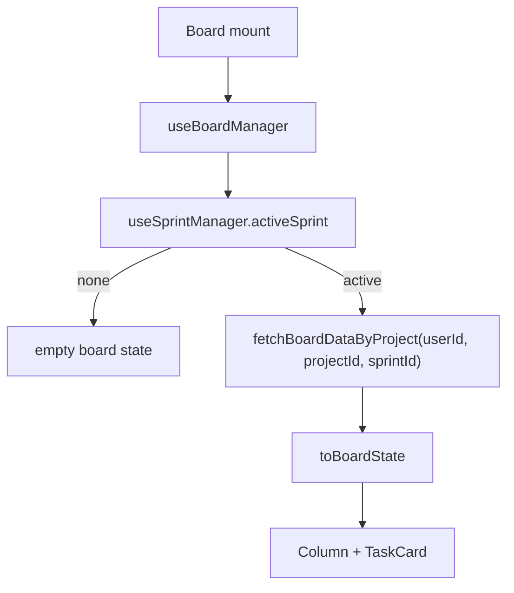

# Board

## Propósito

Board renderiza el trabajo del sprint activo de un proyecto. La ruta `/tablero` monta `Board` con `userId`, `userEmail` y header con `BoardInfo` (`src/app/App.tsx`). El usuario puede cambiar entre layouts de lista, tablero, calendario, tabla y timeline desde `BoardToolbar`; esa preferencia se guarda por proyecto en `localStorage["nexusplanner.boardView.<projectId>"]` (`src/features/board/components/Board.tsx`, `src/features/board/components/BoardToolbar.tsx`, `src/features/board/components/views/BoardLayoutSwitcher.tsx`).

## Modelo de datos

El servicio usa `boards`, `columns`, `column_order`, `tasks` y datos de `epics` para nombres/colores (`src/features/api/boardService.ts`). `columns.color` es el color canónico del estado para badges; está limitado por SQL a la paleta de 12 valores de `src/features/board/statusBadgePalette.ts` (`supabase/migrations/20260904181108_add_column_status_badge_colors.sql`). `TaskRecord` incluye identidad, columna, metadatos de issue, épica, responsable, fechas planeadas y timestamps (`src/features/api/boardService.ts`, `src/shared/types/board.ts`). Las vistas calendario y timeline leen `planned_start_date` y `planned_end_date`; si faltan, usan `created_at` como fallback visual (`src/features/board/components/views/boardViewTypes.ts`).

## Ciclo de vida de las entidades

`fetchBoardDataByProject` carga columnas por `project_id`, lee `column_order`, y carga tareas de esas columnas filtrando por `sprint_id`; sin sprint activo, `useBoardManager` deja `data` en null (`src/features/api/boardService.ts`, `src/features/board/hooks/useBoardManager.ts`). Crear columna inserta en `columns`, agrega al orden y actualiza estado local (`src/features/api/boardService.ts`, `src/features/board/hooks/useBoardManager.ts`). Crear tarea llama `createTaskCommand` y el hook pasa el `sprint_id` activo cuando el destino es Scrum (`src/features/api/boardService.ts`, `src/features/board/hooks/useBoardManager.ts`). Editar tarea pasa por `TaskEditorModal`; si cambia `assignee_id`, `updateTask` delega esa parte a `assignTaskCommand`, y si cambia `column_id` usa `moveTaskColumnCommand` para que el selector de estado mueva la tarjeta de columna y persista tras recargar (`src/features/api/boardService.ts`). Las tareas existentes se abren como drawer desde `handleTaskClick`; el selector `Estado` dentro del drawer llama `handleMoveTaskColumn` inline, mueve la tarjeta optimistamente y revierte si Supabase falla (`src/features/board/hooks/useBoardManager.ts`, `src/features/board/components/TaskEditorModal.tsx`). Calendario y timeline llaman `handleUpdateTaskDates`, hacen actualización optimista de `planned_start_date`/`planned_end_date`, persisten con `updateTask` y revierten si Supabase falla (`src/features/board/hooks/useBoardManager.ts`, `src/features/board/components/views/BoardTaskCalendarView.tsx`, `src/features/board/components/views/BoardTaskTimelineView.tsx`).

## Autorización

La UI bloquea mutaciones cuando `currentProject.can_edit` es falso (`src/features/board/hooks/useBoardManager.ts:24`, `src/features/board/hooks/useBoardManager.ts:194`, `src/features/board/hooks/useBoardManager.ts:480`). El servicio valida que una columna pertenezca al proyecto antes de usarla (`src/features/api/boardService.ts:60`, `src/features/api/boardService.ts:64`).

## Flujos principales

Drag and drop del layout tablero cambia orden local y persiste con `persistColumnOrder` para columnas o `persistTaskOrder` para tareas (`src/features/board/hooks/useBoardManager.ts`, `src/features/api/boardService.ts`). Drag and drop del layout calendario cambia fechas mediante FullCalendar `eventDrop`; resize cambia fechas mediante `eventResize` (`src/features/board/components/views/BoardTaskCalendarView.tsx`). El layout timeline es una vista tipo Gantt sin dependencias: mover la barra conserva duración, arrastrar el borde izquierdo cambia inicio y arrastrar el borde derecho cambia fin (`src/features/board/components/views/BoardTaskTimelineView.tsx`).

Las vistas alternativas del tablero, excepto el layout kanban/tablero, muestran metadatos explícitos de estado y asignado mediante `BoardTaskMeta`: el componente renderiza un chip de estado desde `columnTitle`, coloreado con `columnColor`, `UserAvatar` si hay `assignee_id` y chip `Sin asignar` si no hay responsable (`src/features/board/components/views/BoardTaskMeta.tsx:22`, `src/features/board/components/views/BoardTaskMeta.tsx:49`, `src/features/board/components/views/BoardTaskMeta.tsx:85`). Lista lo muestra en desktop y móvil (`src/features/board/components/views/BoardTaskListView.tsx:76`, `src/features/board/components/views/BoardTaskListView.tsx:83`), calendario lo inyecta en `eventContent` de FullCalendar (`src/features/board/components/views/BoardTaskCalendarView.tsx:45`, `src/features/board/components/views/BoardTaskCalendarView.tsx:167`, `src/features/board/components/views/BoardTaskCalendarView.tsx:179`), tabla usa las variantes `BoardTaskStatusBadge` y `BoardTaskAssigneeBadge` dentro de las columnas `Estado` y `Responsable` (`src/features/board/components/views/BoardTaskTableView.tsx:7`, `src/features/board/components/views/BoardTaskTableView.tsx:88`, `src/features/board/components/views/BoardTaskTableView.tsx:143`), y timeline lo muestra en el panel izquierdo de cada tarea (`src/features/board/components/views/BoardTaskTimelineView.tsx:7`, `src/features/board/components/views/BoardTaskTimelineView.tsx:299`).

La ruta `/epicas` usa `EpicsTable`, que monta `DataTable` con `GridToolbar`, quick filter, menú de columnas habilitado e `initialState` para sorting/visibilidad (`src/features/board/components/EpicsTable/EpicsTable.tsx:23`, `src/features/board/components/EpicsTable/EpicsTable.tsx:247`, `src/features/board/components/EpicsTable/EpicsTable.tsx:250`, `src/features/board/components/EpicsTable/EpicsTable.tsx:257`). `DataTable` pasa `disableColumnMenu`, `slots`, `slotProps` e `initialState` al `DataGrid`, preservando paginación default si el caller no define otra (`src/shared/ui/DataTable/types.ts:16`, `src/shared/ui/DataTable/types.ts:17`, `src/shared/ui/DataTable/types.ts:19`, `src/shared/ui/DataTable/DataTable.tsx:42`, `src/shared/ui/DataTable/DataTable.tsx:44`, `src/shared/ui/DataTable/DataTable.tsx:46`).

## Contratos externos

`TaskEditorModal` recibe `presentation`, `columns`, catálogos, `onSave` y `onDelete`; el mismo componente sirve para creación modal y edición drawer (`src/features/board/components/TaskEditorModal.tsx:38`, `src/features/board/components/TaskEditorModal.tsx:65`, `src/features/board/components/TaskEditorModal.tsx:69`, `src/features/board/components/TaskEditorModal.tsx:70`). En presentación modal de creación exige decisiones explícitas para título, responsable o `Sin asignar`, tipo, prioridad y story points cuando hay catálogos disponibles; `Sin asignar` se guarda como `null`, pero pasa por el sentinel visual `EXPLICIT_UNASSIGNED_ASSIGNEE` para que no sea un vacío accidental (`src/features/board/components/TaskEditorModal.tsx:79`, `src/features/board/components/TaskEditorModal.tsx:119`, `src/features/board/components/TaskEditorModal.tsx:163`, `src/features/board/components/TaskEditorModal.tsx:168`, `src/features/board/components/TaskEditorModal.tsx:173`, `src/features/board/components/TaskEditorModal.tsx:178`, `src/features/board/components/TaskEditorModal.tsx:183`, `src/features/board/components/TaskEditorModal.tsx:207`).

## Errores y casos borde

Errores de catálogos o tablero se convierten en `errorMessage` con `getErrorMessage` y `logError` (`src/features/board/hooks/useBoardManager.ts:52`, `src/features/board/hooks/useBoardManager.ts:106`). Si no hay sprint activo, no carga columnas/tareas aunque existan columnas (`src/features/board/hooks/useBoardManager.ts:72`).

## Trampas

Realtime del tablero está en `useBoardManager`, no en servicio; se subscribe a cambios de `tasks` filtrados por `project_id` y recarga board con debounce mediante el helper compartido (`src/features/board/hooks/useBoardManager.ts:164`, `src/features/board/hooks/useBoardManager.ts:170`, `src/shared/realtime/realtimeChannels.ts:40`). No rompas `column_order`: `toBoardState` usa ese orden para renderizar columnas (`src/features/api/boardService.ts:401`).

No conviertas los campos de la tabla de épicas en columnas genéricas de texto sin revisar filtros: `project`, `phase` y `estimatedEffort` son `singleSelect`, `startDate` y `endDate` son `date`, y `connectedTaskCount` es `number` aunque esté oculto por default para que el menú de columnas pueda activarlo (`src/features/board/components/EpicsTable/columns.tsx:288`, `src/features/board/components/EpicsTable/columns.tsx:338`, `src/features/board/components/EpicsTable/columns.tsx:399`, `src/features/board/components/EpicsTable/columns.tsx:411`, `src/features/board/components/EpicsTable/columns.tsx:420`, `src/features/board/components/EpicsTable/columns.tsx:429`).

No crees tareas del tablero con `supabase.from("tasks").insert(...)`; el command SQL genera `task_id_display`, valida membresía/columna/sprint, registra actividad y encola outbox (`src/features/api/taskCommandService.ts:46`, `supabase/migrations/20260729215527_critical_task_sprint_commands.sql:123`, `supabase/migrations/20260729215527_critical_task_sprint_commands.sql:234`, `supabase/migrations/20260729215527_critical_task_sprint_commands.sql:278`). No reutilices un tópico fijo de Supabase Realtime en el tablero; `useBoardManager` genera un nombre único para evitar agregar callbacks a un canal ya suscrito (`src/features/board/hooks/useBoardManager.ts:170`, `src/shared/realtime/realtimeChannels.ts:22`).

No conectes el timeline del tablero con el roadmap. `TimelineGrid.tsx` renderiza dependencias de roadmap; `BoardTaskTimelineView` solo planifica fechas de tareas y no debe dibujar conectores (`src/features/roadmap/components/TimelineGrid.tsx`, `src/features/board/components/views/BoardTaskTimelineView.tsx`).

No quites el carácter explícito de `Sin asignar` en creación de tareas. Las automatizaciones usan el payload de `task.created`, incluido `assignee_id` e `is_unassigned`, para evaluar reglas sin volver a consultar el estado vivo de `tasks` (`supabase/migrations/20260730061644_enrich_task_created_event_payload.sql:182`, `supabase/migrations/20260730061644_enrich_task_created_event_payload.sql:184`).

## Preguntas abiertas

`boards` se consulta por `user_id`, pero columnas y tareas se consultan por proyecto; no se verificó si `boards` sigue siendo entidad funcional o legado (`src/features/api/boardService.ts:131`, `src/features/api/boardService.ts:148`).
