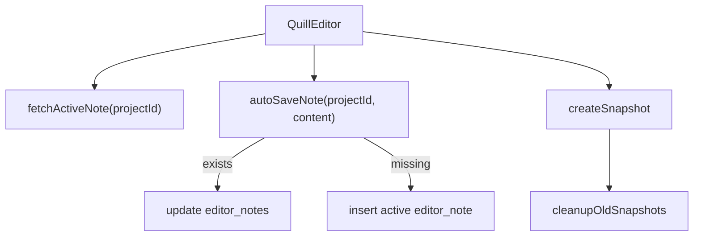

# Editor

## Propósito

Editor guarda notas Quill por proyecto. La ruta `/editor` monta `QuillEditor` con `userId` y título de pantalla (`src/app/App.tsx:72`, `src/app/App.tsx:85`).

## Modelo de datos

`EditorNote` contiene `id`, `board_id`, `project_id`, `content`, timestamps e `is_snapshot` (`src/features/api/editorService.ts:4`). La migración agrega `project_id` a `editor_notes` y políticas por proyecto (`supabase/migrations/20260714020302_link_editor_notes_to_projects.sql:1`, `supabase/migrations/20260714020302_link_editor_notes_to_projects.sql:8`).

## Ciclo de vida de las entidades

`fetchActiveNote` lee una nota no snapshot por `project_id`; `autoSaveNote` actualiza la activa si existe o inserta la primera activa si no existe (`src/features/api/editorService.ts:17`, `src/features/api/editorService.ts:21`, `src/features/api/editorService.ts:54`, `src/features/api/editorService.ts:58`, `src/features/api/editorService.ts:71`). `createSnapshot` inserta una nota snapshot y luego llama limpieza de snapshots antiguos (`src/features/api/editorService.ts:84`, `src/features/api/editorService.ts:86`, `src/features/api/editorService.ts:95`). `cleanupOldSnapshots` conserva solo los 10 más recientes (`src/features/api/editorService.ts:137`, `src/features/api/editorService.ts:145`).

## Autorización

No se evalúa en el servicio más allá de filtrar `project_id`; depende de RLS de `editor_notes` y `can_view_project` para notas visibles según migración (`src/features/api/editorService.ts:21`, `supabase/migrations/20260717195219_organization_invitations_project_visibility.sql:262`).

## Flujos principales

## Contratos externos

El contenido se tipa como `unknown`; el contrato exacto lo impone Quill, no el servicio (`src/features/api/editorService.ts:8`, `src/features/editor/QuillEditor.tsx:40`).

## Errores y casos borde

`deleteSnapshot` atrapa errores, los loguea y retorna `false` en vez de lanzar (`src/features/api/editorService.ts:118`, `src/features/api/editorService.ts:128`). `restoreSnapshot` obtiene contenido del snapshot y llama `autoSaveNote`, por lo que no convierte el snapshot en activa por cambio de `is_snapshot` (`src/features/api/editorService.ts:101`, `src/features/api/editorService.ts:112`).

## Trampas

No borres la condición `.eq("is_snapshot", true)` en `deleteSnapshot`; el comentario indica que solo snapshots deben borrarse, no la nota activa (`src/features/api/editorService.ts:120`, `src/features/api/editorService.ts:124`).

## Preguntas abiertas

No se verificó si la UI permite múltiples notas activas si la base no tiene unique parcial; el servicio usa `.maybeSingle()` y fallaría si existen varias (`src/features/api/editorService.ts:23`).
