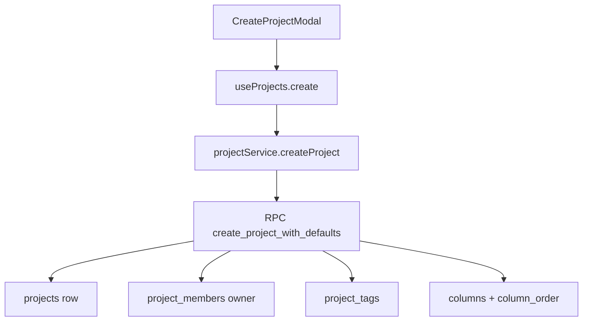

# Projects And Organizations

## Propósito

Este módulo gestiona organizaciones, proyectos, selector, creación y settings. Un proyecto pertenece a una organización por `organization_id`, y la UI opera con `activeOrganization` y `currentProject` desde `ProjectContext` (`supabase/migrations/20260717081648_add_organizations.sql:161`, `src/shared/contexts/ProjectContext.tsx:11`, `src/shared/contexts/ProjectContext.tsx:6`).

## Modelo de datos

`organizations` tiene `id`, `name`, `logo_url`, `created_by`, timestamps (`supabase/migrations/20260717081648_add_organizations.sql:1`). `organization_members` une organización y usuario con `role` checkeado a `owner`, `admin` o `member` y unique `(organization_id, user_id)` (`supabase/migrations/20260717081648_add_organizations.sql:10`, `supabase/migrations/20260717081648_add_organizations.sql:14`, `supabase/migrations/20260717081648_add_organizations.sql:16`). `Project` contiene `organization_id`, `title`, `description`, `project_key`, secuencias, `allow_board_task_creation`, `visibility` y `banner_url` (`src/features/api/projectService.ts:4`).

## Ciclo de vida de las entidades

Crear organización llama RPC `create_organization_with_owner`, que inserta organización con `created_by = auth.uid()` e inserta al creador como `owner` en `organization_members` (`src/features/api/organizationService.ts:134`, `supabase/migrations/20260717081648_add_organizations.sql:77`, `supabase/migrations/20260717081648_add_organizations.sql:81`). Crear proyecto valida `project_key`, revisa duplicados, intenta RPC `create_project_with_defaults` y retorna tags; la RPC crea proyecto, `project_members` owner, tags, cuatro columnas y `column_order` (`src/features/api/projectService.ts:287`, `src/features/api/projectService.ts:295`, `src/features/api/projectService.ts:307`, `supabase/migrations/20260717041858_create_project_with_defaults_rpc.sql:55`, `supabase/migrations/20260717041858_create_project_with_defaults_rpc.sql:73`, `supabase/migrations/20260717041858_create_project_with_defaults_rpc.sql:84`, `supabase/migrations/20260717041858_create_project_with_defaults_rpc.sql:93`, `supabase/migrations/20260717041858_create_project_with_defaults_rpc.sql:114`). Eliminar proyecto borra `projects` y exige fila devuelta (`src/features/api/projectService.ts:423`, `src/features/api/projectService.ts:432`).

## Autorización

La base habilita RLS en organizaciones y miembros (`supabase/migrations/20260717081648_add_organizations.sql:19`). `is_organization_member` e `is_organization_admin` determinan lectura y administración (`supabase/migrations/20260717081648_add_organizations.sql:22`, `supabase/migrations/20260717081648_add_organizations.sql:37`). `can_view_project` permite proyecto visible si hay membresía de proyecto o visibilidad de organización más membresía de organización (`supabase/migrations/20260717195219_organization_invitations_project_visibility.sql:5`). La UI marca `can_edit` si el usuario tiene fila en `project_members` para ese proyecto (`src/features/api/projectService.ts:235`, `src/features/api/projectService.ts:251`).

## Flujos principales

Invitar a organización por email llama `createOrganizationInvitationByEmail`, que normaliza correo y ejecuta RPC `create_organization_invitation_by_email` (`src/features/api/organizationService.ts:277`, `src/features/api/organizationService.ts:281`, `src/features/api/organizationService.ts:287`). Aceptar invitación ejecuta RPC `accept_organization_invitation`, y la función SQL inserta `organization_members` con rol `member` y marca la invitación `accepted` (`src/features/api/organizationService.ts:347`, `supabase/migrations/20260717195219_organization_invitations_project_visibility.sql:103`, `supabase/migrations/20260717195219_organization_invitations_project_visibility.sql:107`).

## Contratos externos

Storage de banners usa bucket `project-assets` bajo `project-banners/{projectId}/banner.ext` y actualiza `projects.banner_url` (`src/features/api/projectService.ts:626`, `src/features/api/projectService.ts:629`, `src/features/api/projectService.ts:631`, `src/features/api/projectService.ts:646`). Logos de organización usan `project-assets/organization-logos/{organizationId}/logo.ext` y actualizan `organizations.logo_url` (`src/features/api/organizationService.ts:165`, `src/features/api/organizationService.ts:170`, `src/features/api/organizationService.ts:181`).

## Errores y casos borde

Si la RPC de creación de proyecto falta, el fallback crea a mano y borra el proyecto parcial si falla cualquier paso (`src/features/api/projectService.ts:87`, `src/features/api/projectService.ts:113`, `src/features/api/projectService.ts:186`). `updateProject` impide cambiar `project_key` si ya existen tareas o épicas (`src/features/api/projectService.ts:343`, `src/features/api/projectService.ts:358`).

## Trampas

No agregues usuarios a un proyecto si no pertenecen a la organización; la política `Project owners can add organization members` verifica que el usuario objetivo esté en `organization_members` de la organización del proyecto (`supabase/migrations/20260717195219_organization_invitations_project_visibility.sql:176`, `supabase/migrations/20260717195219_organization_invitations_project_visibility.sql:199`). No cambies las cuatro columnas iniciales sin revisar RPC y fallback, porque existen dos implementaciones (`supabase/migrations/20260717041858_create_project_with_defaults_rpc.sql:99`, `src/features/api/projectService.ts:53`).

## Preguntas abiertas

La migración `20260717041858_create_project_with_defaults_rpc.sql` muestra una firma de RPC de cuatro parámetros, mientras `projectService.createProject` llama una versión con `p_organization_id` y `p_visibility`; esa versión puede provenir de migración posterior no inspeccionada aquí o del estado remoto (`supabase/migrations/20260717041858_create_project_with_defaults_rpc.sql:4`, `src/features/api/projectService.ts:308`).
