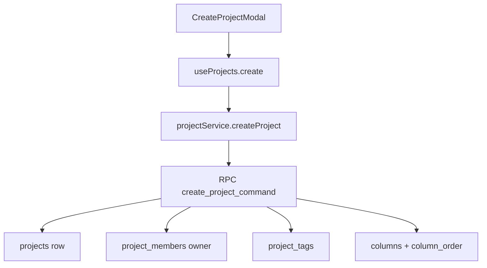

# Projects And Organizations

## Propósito

Este módulo gestiona organizaciones, proyectos, selector, creación y settings. Un proyecto pertenece a una organización por `organization_id`, y la UI opera con `activeOrganization` y `currentProject` desde `ProjectContext` (`supabase/migrations/20260717081648_add_organizations.sql:161`, `src/shared/contexts/ProjectContext.tsx:11`, `src/shared/contexts/ProjectContext.tsx:6`).

## Modelo de datos

`organizations` tiene `id`, `name`, `logo_url`, `created_by`, timestamps (`supabase/migrations/20260717081648_add_organizations.sql:1`). `organization_members` une organización y usuario con `role` checkeado a `owner`, `admin` o `member` y unique `(organization_id, user_id)` (`supabase/migrations/20260717081648_add_organizations.sql:10`, `supabase/migrations/20260717081648_add_organizations.sql:14`, `supabase/migrations/20260717081648_add_organizations.sql:16`). `Project` contiene `organization_id`, `title`, `description`, `project_key`, secuencias, `allow_board_task_creation`, `visibility` y `banner_url` (`src/features/api/projectService.ts:4`).

La pestaña de automatizaciones del modal de configuración del proyecto edita `automation_rules` y muestra `automation_runs`; ambas tablas están scopiadas por `organization_id` y `project_id` (`supabase/migrations/20260730055853_premium_automation_rules.sql:1`, `supabase/migrations/20260730055853_premium_automation_rules.sql:21`, `src/features/projects/components/ProjectSettingsModal.tsx:248`, `src/features/projects/components/ProjectSettingsModal.tsx:249`).

Los colores de badges de estado se editan desde la sección General de `ProjectSettingsModal`. El modal lee las columnas del proyecto, actualiza solo `columns.color` y emite `nexusplanner:column-badge-colors-changed` para que el tablero activo refresque sus vistas sin recargar la página (`src/features/projects/components/ProjectSettingsModal.tsx`, `src/features/api/boardService.ts`, `supabase/migrations/20260904181108_add_column_status_badge_colors.sql`).

## Ciclo de vida de las entidades

Crear organización llama `createOrganizationCommand`, que ejecuta `create_organization_command` para insertar organización, owner, activity event y outbox en una transacción (`src/features/api/organizationService.ts:143`, `src/features/api/workspaceCommandService.ts:28`, `supabase/migrations/20260730033038_workspace_transaction_commands.sql:1`, `supabase/migrations/20260730033038_workspace_transaction_commands.sql:23`, `supabase/migrations/20260730033038_workspace_transaction_commands.sql:28`). Crear proyecto llama `createProjectCommand`, que ejecuta `create_project_command` para crear proyecto, `project_members` owner, tags, cuatro columnas, `column_order`, activity event y outbox; el frontend ya no tiene fallback de inserts parciales (`src/features/api/projectService.ts:158`, `src/features/api/workspaceCommandService.ts:43`, `supabase/migrations/20260730033038_workspace_transaction_commands.sql:54`, `supabase/migrations/20260730033038_workspace_transaction_commands.sql:144`, `supabase/migrations/20260730033038_workspace_transaction_commands.sql:154`, `supabase/migrations/20260730033038_workspace_transaction_commands.sql:165`, `supabase/migrations/20260730033038_workspace_transaction_commands.sql:183`). Eliminar proyecto borra `projects` y exige fila devuelta (`src/features/api/projectService.ts:222`, `src/features/api/projectService.ts:231`).

## Autorización

La base habilita RLS en organizaciones y miembros (`supabase/migrations/20260717081648_add_organizations.sql:19`). La autorización de organización/proyecto está centralizada en funciones SQL: `current_organization_role`, `current_project_role`, `can_view_organization`, `can_manage_organization`, `can_view_project`, `can_mutate_project`, `can_manage_project`, `can_add_project_member`, `can_invite_to_organization` y `can_invite_to_project` (`supabase/migrations/20260730034117_centralized_sql_permissions.sql:1`, `supabase/migrations/20260730034117_centralized_sql_permissions.sql:15`, `supabase/migrations/20260730034117_centralized_sql_permissions.sql:29`, `supabase/migrations/20260730034117_centralized_sql_permissions.sql:39`, `supabase/migrations/20260730034117_centralized_sql_permissions.sql:59`, `supabase/migrations/20260730034117_centralized_sql_permissions.sql:80`, `supabase/migrations/20260730034117_centralized_sql_permissions.sql:90`, `supabase/migrations/20260730034117_centralized_sql_permissions.sql:100`, `supabase/migrations/20260730034117_centralized_sql_permissions.sql:130`, `supabase/migrations/20260730034117_centralized_sql_permissions.sql:140`). Los helpers legacy `is_organization_member`, `is_organization_admin`, `is_project_member`, `is_project_owner` y `can_edit_project` delegan en esa capa para compatibilidad con policies existentes (`supabase/migrations/20260730034117_centralized_sql_permissions.sql:172`, `supabase/migrations/20260730034117_centralized_sql_permissions.sql:182`, `supabase/migrations/20260730034117_centralized_sql_permissions.sql:192`, `supabase/migrations/20260730034117_centralized_sql_permissions.sql:202`, `supabase/migrations/20260730034117_centralized_sql_permissions.sql:212`). La UI marca `can_edit` si el usuario tiene fila en `project_members` para ese proyecto (`src/features/api/projectService.ts:235`, `src/features/api/projectService.ts:251`).

## Flujos principales

Invitar a organización por email llama `createOrganizationInvitationByEmail`, que normaliza correo y ejecuta `create_organization_invitation_command`; aceptar/rechazar invitación usa commands equivalentes, y la función SQL inserta `organization_members` con rol `member`, marca la invitación y registra evento/outbox (`src/features/api/organizationService.ts:264`, `src/features/api/organizationService.ts:271`, `src/features/api/organizationService.ts:343`, `src/features/api/workspaceCommandService.ts:61`, `supabase/migrations/20260730033038_workspace_transaction_commands.sql:200`, `supabase/migrations/20260730033038_workspace_transaction_commands.sql:359`).

Automatizaciones se configuran desde `ProjectSettingsModal` con un patrón visual tipo monday/Jira: lista de reglas a la izquierda, builder a la derecha con bloques `Cuando`, `Si` y `Entonces`, y un historial de ejecuciones abajo (`src/features/projects/components/ProjectSettingsModal.tsx:631`, `src/features/projects/components/ProjectSettingsModal.tsx:696`, `src/features/projects/components/ProjectSettingsModal.tsx:765`, `src/features/projects/components/ProjectSettingsModal.tsx:872`, `src/features/projects/components/ProjectSettingsModal.tsx:957`, `src/features/projects/components/ProjectSettingsModal.tsx:1048`). Guardar construye un payload con `trigger_event`, condiciones y acciones y llama `createAutomationRule` o `updateAutomationRule`; el modal no ejecuta acciones (`src/features/projects/components/ProjectSettingsModal.tsx:337`, `src/features/projects/components/ProjectSettingsModal.tsx:352`, `src/features/projects/components/ProjectSettingsModal.tsx:360`, `src/features/projects/components/ProjectSettingsModal.tsx:381`, `src/features/projects/components/ProjectSettingsModal.tsx:386`).

## Contratos externos

Storage de banners usa bucket `project-assets` bajo `project-banners/{projectId}/banner.ext` y actualiza `projects.banner_url` (`src/features/api/projectService.ts:626`, `src/features/api/projectService.ts:629`, `src/features/api/projectService.ts:631`, `src/features/api/projectService.ts:646`). Logos de organización usan `project-assets/organization-logos/{organizationId}/logo.ext` y actualizan `organizations.logo_url` (`src/features/api/organizationService.ts:165`, `src/features/api/organizationService.ts:170`, `src/features/api/organizationService.ts:181`).

## Errores y casos borde

Los commands de workspace impiden invitar usuarios que no existen, invitarse a sí misma, duplicar invitaciones pendientes, agregar a proyecto usuarios fuera de la organización y quitar/demover el último owner (`supabase/migrations/20260730033038_workspace_transaction_commands.sql:232`, `supabase/migrations/20260730033038_workspace_transaction_commands.sql:236`, `supabase/migrations/20260730033038_workspace_transaction_commands.sql:288`, `supabase/migrations/20260730033038_workspace_transaction_commands.sql:533`, `supabase/migrations/20260730033038_workspace_transaction_commands.sql:632`, `supabase/migrations/20260730033038_workspace_transaction_commands.sql:710`). `updateProject` impide cambiar `project_key` si ya existen tareas o épicas (`src/features/api/projectService.ts:178`, `src/features/api/projectService.ts:193`).

## Trampas

No agregues usuarios a un proyecto con `insert` directo en `project_members`; usa `add_project_member_command`, que verifica owner de proyecto y membresía de organización (`src/features/api/projectService.ts:357`, `supabase/migrations/20260730033038_workspace_transaction_commands.sql:661`, `supabase/migrations/20260730033038_workspace_transaction_commands.sql:696`). No cambies las cuatro columnas iniciales sin revisar `create_project_command`, porque ese command es la autoridad de creación de proyecto (`supabase/migrations/20260730033038_workspace_transaction_commands.sql:154`).

No conviertas el builder de automatizaciones en lógica frontend. Los combos del modal solo producen JSON para `automation_rules`; el disparo real depende de `activity_events` y del trigger SQL `evaluate_automation_rules_after_activity_event` (`src/features/projects/components/ProjectSettingsModal.tsx:360`, `src/features/api/automationService.ts:112`, `supabase/migrations/20260730055853_premium_automation_rules.sql:347`, `supabase/migrations/20260730055853_premium_automation_rules.sql:462`).

## Preguntas abiertas

No aplica.
