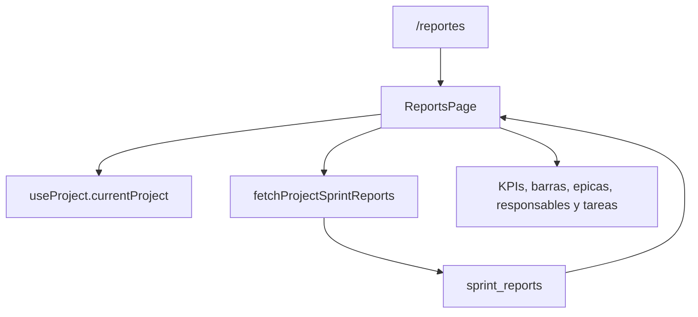

# Reportes

## Propósito

Reportes muestra snapshots historicos de sprints cerrados. Existe separado del tablero porque no opera sobre tareas vivas: lee `sprint_reports` y renderiza el artefacto creado al completar un sprint (`src/features/api/reportService.ts:39`, `src/features/reports/components/ReportsPage.tsx:292`).

## Modelo de datos

`SprintReport` contiene proyecto, sprint, fechas, tareas totales, tareas completas/incompletas, story points totales/completos/incompletos, tasas de cumplimiento y `snapshot` (`src/features/api/reportService.ts:39`). El `snapshot` incluye `totals_by_status`, arreglo de tareas y disposiciones de cierre (`src/features/api/reportService.ts:25`). La tabla `sprint_reports` y su RLS se crean en la migracion de reportes backend (`supabase/migrations/20260730052854_backend_sprint_reports.sql:1`, `supabase/migrations/20260730052854_backend_sprint_reports.sql:38`, `supabase/migrations/20260730052854_backend_sprint_reports.sql:41`).

## Ciclo de vida de las entidades

La pantalla no crea reportes. Cargar `/reportes` llama `fetchProjectSprintReports(currentProject.id)` y selecciona el reporte mas reciente si no hay seleccion previa (`src/features/reports/components/ReportsPage.tsx:298`, `src/features/api/reportService.ts:96`). El cierre de sprint genera o actualiza el reporte historico mediante `generate_sprint_report`; no recalcules un reporte cerrado desde `tasks` en esta pantalla (`supabase/migrations/20260730052854_backend_sprint_reports.sql:68`, `supabase/migrations/20260730052854_backend_sprint_reports.sql:248`, `src/features/api/CODEX.md:45`).

## Autorización

La lectura depende de RLS de `sprint_reports`, que permite `select` a usuarios autenticados con `can_view_project(project_id)` (`supabase/migrations/20260730052854_backend_sprint_reports.sql:41`). `ReportsPage` no evalua permisos de escritura porque no muta datos (`src/features/reports/components/ReportsPage.tsx:292`).

## Flujos principales

## Contratos externos

El contrato externo del modulo es la ruta `/reportes` declarada en `App.tsx` y el item `Reportes` del sidebar (`src/app/App.tsx:72`, `src/app/Layout.tsx:80`). Su unico consumo de datos es `reportService` (`src/features/reports/components/ReportsPage.tsx:29`).

La columna izquierda es el indice de reportes por sprint y queda fija en desktop mientras scrollea el detalle del reporte; si hay muchos sprints, esa columna usa scroll interno (`src/features/reports/components/ReportsPage.tsx:390`).

## Errores y casos borde

Si no hay proyecto seleccionado, muestra un estado vacio de seleccion de proyecto (`src/features/reports/components/ReportsPage.tsx:352`). Si el proyecto no tiene reportes, muestra un estado vacio que explica que los reportes aparecen al completar sprints (`src/features/reports/components/ReportsPage.tsx:377`). Los errores de carga pasan por `getErrorMessage` y `logError` (`src/features/reports/components/ReportsPage.tsx:324`).

## Trampas

No uses `tasks` vivas para reconstruir reportes pasados: al cerrar un sprint, las tareas incompletas pueden moverse a backlog u otro sprint, así que el snapshot de `sprint_reports` es la fuente de verdad historica (`src/features/api/CODEX.md:45`). Si agregas burndown real, primero crea snapshots backend por dia; la pantalla actual solo puede mostrar metricas presentes en `sprint_reports`.

## Preguntas abiertas

No hay vista de detalle exportable a PDF/CSV. No existe aun una tabla de snapshots diarios para burndown o burnup real.
