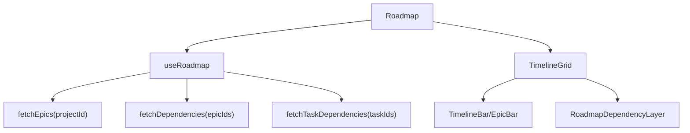

# Roadmap

## Propósito

Roadmap visualiza épicas y opcionalmente tareas hijas en un timeline con barras arrastrables y dependencias. La ruta `/roadmap` monta `Roadmap` con `userId` (`src/app/App.tsx:67`, `src/app/App.tsx:69`).

## Modelo de datos

Las barras de épica usan `EpicWithDetails`; las tareas del roadmap usan `RoadmapTask` con `planned_start_date`, `planned_end_date`, `sprint_id`, `column_id`, prioridad, puntos y asignación (`src/features/api/epicService.ts:26`, `src/features/api/epicService.ts:51`). Las dependencias son `epic_dependencies` y `task_dependencies`, con `dependency_type` y `lag_days` (`src/features/api/dependencyService.ts:3`, `src/features/api/dependencyService.ts:12`).

La escala visual de Roadmap acepta `weeks`, `months` y `quarters` mediante `RoadmapTimelineMode`; `quarters` no agrega datos nuevos, sino que deriva su rango desde fechas de épicas, fechas planeadas de tareas y fechas de sprint de tareas conectadas (`src/features/roadmap/utils/timelineRange.ts:5`, `src/features/roadmap/utils/timelineRange.ts:27`, `src/features/roadmap/utils/timelineRange.ts:31`, `src/features/roadmap/utils/timelineRange.ts:60`).

## Ciclo de vida de las entidades

`fetchEpics` carga épicas por `user_id` y `project_id`, luego consulta tareas con `tasks.epic_id = epic.id` y `project_id` igual al proyecto (`src/features/api/epicService.ts:80`, `src/features/api/epicService.ts:97`, `src/features/api/epicService.ts:106`, `src/features/api/epicService.ts:122`). Crear épica exige `project_id` e inserta default color `#3B82F6` si no se provee (`src/features/api/epicService.ts:178`, `src/features/api/epicService.ts:191`, `src/features/api/epicService.ts:195`, `src/features/api/epicService.ts:199`). `TimelineGrid` permite actualizar fechas de épicas/tareas, mover tareas entre épicas, crear tareas bajo épica y crear/borrar dependencias por callbacks (`src/features/roadmap/components/TimelineGrid.tsx:59`, `src/features/roadmap/components/TimelineGrid.tsx:60`, `src/features/roadmap/components/TimelineGrid.tsx:61`, `src/features/roadmap/components/TimelineGrid.tsx:62`, `src/features/roadmap/components/TimelineGrid.tsx:63`).

## Autorización

Roadmap recibe `readOnly` y no debe crear/mover dependencias si no puede editar; en hook, creación/borrado de dependencias retorna si `canEditProject` es falso (`src/features/roadmap/components/TimelineGrid.tsx:68`, `src/features/roadmap/hooks/useRoadmap.ts:202`, `src/features/roadmap/hooks/useRoadmap.ts:219`). El servicio valida extremos dentro del mismo proyecto y ciclos (`src/features/api/dependencyService.ts:80`, `src/features/api/dependencyService.ts:98`, `src/features/api/dependencyService.ts:116`, `src/features/api/dependencyService.ts:145`).

## Flujos principales

`TimelineGrid` construye líneas visuales invirtiendo semánticamente `depends_on_*` como source y `*_id` como target (`src/features/roadmap/components/TimelineGrid.tsx:168`, `src/features/roadmap/components/TimelineGrid.tsx:174`, `src/features/roadmap/components/TimelineGrid.tsx:175`, `src/features/roadmap/components/TimelineGrid.tsx:181`, `src/features/roadmap/components/TimelineGrid.tsx:182`).

`fetchTaskDependencies` carga dependencias por chunks de tareas y filtra `depends_on_task_id` en memoria para no construir URLs enormes de PostgREST cuando un proyecto tiene muchas tareas (`src/features/api/dependencyService.ts:20`, `src/features/api/dependencyService.ts:50`). `useRoadmap.loadData` conserva las epicas cargadas si solo falla la carga de dependencias, dejando conectores vacios en vez de vaciar la pantalla (`src/features/roadmap/hooks/useRoadmap.ts:64`).

`Roadmap` y `TimelineGrid` comparten `getRoadmapTimelineRange`; el texto superior y la cuadrícula no deben calcular rangos por separado (`src/features/roadmap/components/Roadmap.tsx:64`, `src/features/roadmap/components/TimelineGrid.tsx:134`, `src/features/roadmap/utils/timelineRange.ts:39`). En modo `quarters`, `TimelineGrid` crea unidades proporcionales con `getQuarterUnits` y `QUARTER_DAY_WIDTH`, manteniendo el posicionamiento de barras por diferencia real de días (`src/features/roadmap/components/TimelineGrid.tsx:214`, `src/features/roadmap/components/TimelineGrid.tsx:215`, `src/features/roadmap/components/TimelineGridParts.tsx:12`, `src/features/roadmap/utils/timelineRange.ts:86`).

## Contratos externos

`RoadmapDependencyLayer` recibe dependencias, `scrollContainerRef`, `refreshKey`, colores y callback de delete (`src/features/roadmap/components/RoadmapDependencyLayer.tsx:25`). Usa `@xyflow/react` para nodos/edges invisibles y routing visual (`src/features/roadmap/components/RoadmapDependencyLayer.tsx:4`, `src/features/roadmap/components/RoadmapDependencyLayer.tsx:64`).

## Errores y casos borde

Los ciclos se bloquean en frontend/service y además en SQL con triggers recursivos para épicas y tareas (`src/features/api/dependencyService.ts:140`, `src/features/api/dependencyService.ts:169`, `supabase/migrations/20260717030110_prevent_roadmap_dependency_cycles.sql:38`, `supabase/migrations/20260717030110_prevent_roadmap_dependency_cycles.sql:80`). `TimelineGrid` calcula fechas default para tareas sin fechas dentro del rango visible (`src/features/roadmap/components/TimelineGrid.tsx:97`).

Si el proyecto no tiene fechas de roadmap, `quarters` muestra un rango mínimo de dos trimestres desde la fecha base; si hay fechas, incluye la fecha base en el cálculo y redondea inicio/fin a límites de trimestre (`src/features/roadmap/utils/timelineRange.ts:60`, `src/features/roadmap/utils/timelineRange.ts:64`, `src/features/roadmap/utils/timelineRange.ts:67`, `src/features/roadmap/utils/timelineRange.ts:73`).

## Trampas

Los conectores dependen de mediciones DOM; `RoadmapDependencyLayer` calcula rutas contra obstáculos y offsets (`src/features/roadmap/components/RoadmapDependencyLayer.tsx:112`, `src/features/roadmap/components/RoadmapDependencyLayer.tsx:162`). No cambies ids/source/target sin revisar `dependencyLines`, porque la dirección visual usa `depends_on_*` como origen (`src/features/roadmap/components/TimelineGrid.tsx:174`, `src/features/roadmap/components/TimelineGrid.tsx:181`).

No vuelvas a deshabilitar `quarters` en el selector sin cambiar también `RoadmapTimelineMode`, `TimelineUnit` y `getRoadmapTimelineRange`; el botón activo vive en `Roadmap`, pero el rango y las unidades viven fuera del componente para evitar desalinear header y grid (`src/features/roadmap/components/Roadmap.tsx:40`, `src/features/roadmap/components/Roadmap.tsx:264`, `src/features/roadmap/components/Roadmap.tsx:266`, `src/features/roadmap/components/TimelineGridParts.tsx:19`, `src/features/roadmap/utils/timelineRange.ts:39`).

## Preguntas abiertas

No se documentó aquí el cuerpo completo de `useRoadmap.ts` porque la salida fue truncada; antes de editar callbacks de roadmap, leer completo ese archivo.
