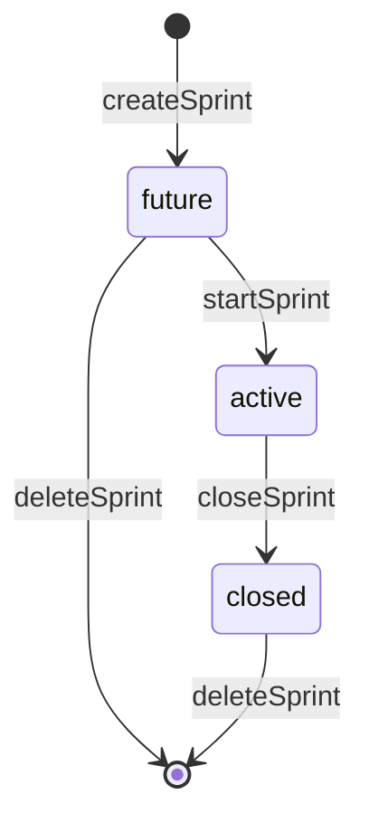

# Sprints

## Propósito

Sprints agrupa tareas de backlog para ejecución y alimenta el tablero activo. `useSprintManager` es el hook consumido por Backlog y Board (`src/features/backlog/hooks/useBacklogTable.ts:18`, `src/features/board/hooks/useBoardManager.ts:21`).

## Modelo de datos

`SprintStatus` permite `future`, `active` y `closed`; `Sprint` incluye `id`, `project_id`, `name`, `goal`, `status`, `start_date`, `end_date`, timestamps (`src/features/sprints/types/sprint.ts:1`, `src/features/sprints/types/sprint.ts:3`). `SprintTaskRecord` modela tareas de sprint con columna, épica, asignación y prioridad (`src/features/api/sprintService.ts:45`).

## Ciclo de vida de las entidades

Crear sprint inserta `status: "future"` con fechas (`src/features/api/sprintService.ts:108`, `src/features/api/sprintService.ts:119`). Iniciar sprint busca otro activo en el mismo proyecto, falla si existe y actualiza solo si el sprint está en `future` (`src/features/api/sprintService.ts:153`, `src/features/api/sprintService.ts:162`, `src/features/api/sprintService.ts:166`, `src/features/api/sprintService.ts:174`). Cerrar sprint llama `completeSprintCommand`; con incompletas, `closeSprintWithTaskDisposition` manda las disposiciones a la misma RPC (`src/features/api/sprintService.ts:184`, `src/features/api/sprintService.ts:391`, `src/features/api/taskCommandService.ts:80`). Eliminar sprint borra por `id` y `project_id`, y falla si no hay fila devuelta (`src/features/api/sprintService.ts:189`, `src/features/api/sprintService.ts:199`).

## Autorización

Todas las operaciones de sprint en servicio reciben `projectId` y filtran por `project_id` (`src/features/api/sprintService.ts:82`, `src/features/api/sprintService.ts:136`, `src/features/api/sprintService.ts:190`). La base agrega índice único parcial para un solo activo por proyecto (`supabase/migrations/20260722002522_enforce_single_active_sprint.sql:21`).

## Flujos principales

Completar sprint usa `SprintCompletionSummary` con tareas completas e incompletas (`src/features/api/sprintService.ts:61`, `src/features/api/sprintService.ts:66`). Las tareas incompletas pueden tener disposición `backlog` o `sprint` con `sprintId` opcional (`src/features/api/sprintService.ts:71`).

La autoridad de cierre está en `complete_sprint_command`: bloquea el sprint activo, calcula incompletas, exige una decisión por cada tarea incompleta, mueve cada tarea y cierra el sprint dentro de la misma transacción (`supabase/migrations/20260729215527_critical_task_sprint_commands.sql:462`, `supabase/migrations/20260729215527_critical_task_sprint_commands.sql:487`, `supabase/migrations/20260729215527_critical_task_sprint_commands.sql:522`, `supabase/migrations/20260729215527_critical_task_sprint_commands.sql:555`, `supabase/migrations/20260729215527_critical_task_sprint_commands.sql:584`, `supabase/migrations/20260729215527_critical_task_sprint_commands.sql:598`).

El cierre también genera un reporte backend antes de mover incompletas. La versión reemplazada de `complete_sprint_command` llama `generate_sprint_report`, que inserta o actualiza `sprint_reports` con totales, story points, completion rates, snapshot de tareas y disposiciones, y después encola `report.sprint_completed` con `job_key` idempotente para post-procesamiento (`supabase/migrations/20260730052854_backend_sprint_reports.sql:68`, `supabase/migrations/20260730052854_backend_sprint_reports.sql:301`, `supabase/migrations/20260730052854_backend_sprint_reports.sql:455`, `supabase/migrations/20260730052854_backend_sprint_reports.sql:552`, `supabase/migrations/20260730052854_backend_sprint_reports.sql:554`). `normalize_sprint_report_before_write` marca el reporte como `closed` aunque se haya capturado antes de actualizar `sprints.status` (`supabase/migrations/20260730053303_fix_sprint_report_closed_status.sql:1`, `supabase/migrations/20260730053303_fix_sprint_report_closed_status.sql:9`, `supabase/migrations/20260730053303_fix_sprint_report_closed_status.sql:27`). No recalcules reportes históricos a partir de tareas vivas después del cierre, porque las incompletas pueden haber sido movidas a backlog o a otro sprint.

Los deadlines de sprint se vigilan desde cron SQL, no desde una pantalla. `scan_sprint_deadlines` revisa sprints activos con `end_date` de mañana y crea `sprint_due_soon`; también revisa sprints activos vencidos y crea `sprint_overdue` con dedupe diario para miembros del proyecto (`supabase/migrations/20260730053934_scheduled_maintenance_cron.sql:45`, `supabase/migrations/20260730053934_scheduled_maintenance_cron.sql:80`, `supabase/migrations/20260730053934_scheduled_maintenance_cron.sql:94`, `supabase/migrations/20260730053934_scheduled_maintenance_cron.sql:123`, `supabase/migrations/20260730053934_scheduled_maintenance_cron.sql:138`). Ese cron no cierra el sprint ni mueve tareas; `complete_sprint_command` sigue siendo la única ruta de cierre porque requiere disposiciones por incompleta y genera el reporte backend.

## Contratos externos

`SprintDropZone` recibe `sprint`, `tasks`, `onStartSprint`, `canStartSprint`, `canAcceptTasks` y datos de capacidad (`src/features/sprints/components/SprintDropZone.tsx:14`). El drop zone deshabilita drop si el sprint está cerrado o no acepta tareas (`src/features/sprints/components/SprintDropZone.tsx:52`, `src/features/sprints/components/SprintDropZone.tsx:55`).

## Errores y casos borde

`startSprint` lanza error si ya existe sprint activo en el proyecto (`src/features/api/sprintService.ts:162`). `fetchActiveSprint` ordena por `updated_at` y `created_at` y toma el primero, aunque la base intenta garantizar uno solo (`src/features/api/sprintService.ts:94`, `src/features/api/sprintService.ts:100`).

## Trampas

No permitas múltiples activos en UI aunque la BD tenga índice: el servicio ya da error de dominio antes de chocar contra índice (`src/features/api/sprintService.ts:153`). `SprintDropZone` normaliza la fecha final con `getNormalizedSprintEndDate`; si cambias reglas de duración, revisa ese util y la UI (`src/features/sprints/components/SprintDropZone.tsx:12`, `src/features/sprints/components/SprintDropZone.tsx:41`).

No cierres sprints con `supabase.from("sprints").update({ status: "closed" })` desde nuevos servicios. Eso saltaría la validación por tarea incompleta, los eventos y la cola/outbox (`src/features/api/taskCommandService.ts:80`, `supabase/migrations/20260729215527_critical_task_sprint_commands.sql:606`, `supabase/migrations/20260729215527_critical_task_sprint_commands.sql:627`).

No conviertas `sprint_overdue` en cierre automático. Un sprint vencido solo produce aviso; el usuario todavía debe completar el sprint con la modal de decisiones por tarea incompleta.

## Preguntas abiertas

No se verificó el contenido completo de `useSprintManager.ts`; esta documentación se apoya en tipos, servicio y componentes leídos.
