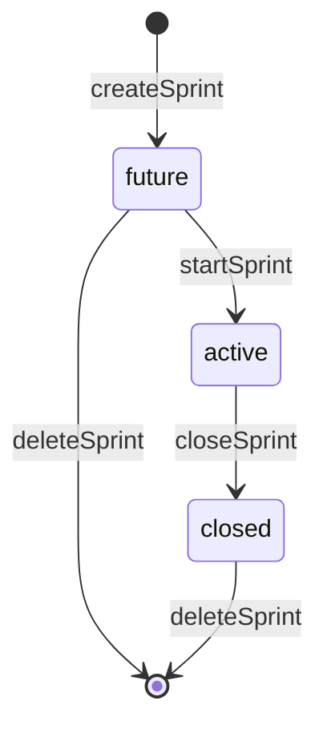

# Sprints

## Propósito

Sprints agrupa tareas de backlog para ejecución y alimenta el tablero activo. `useSprintManager` es el hook consumido por Backlog y Board (`src/features/backlog/hooks/useBacklogTable.ts:18`, `src/features/board/hooks/useBoardManager.ts:21`).

## Modelo de datos

`SprintStatus` permite `future`, `active` y `closed`; `Sprint` incluye `id`, `project_id`, `name`, `goal`, `status`, `start_date`, `end_date`, timestamps (`src/features/sprints/types/sprint.ts:1`, `src/features/sprints/types/sprint.ts:3`). `SprintTaskRecord` modela tareas de sprint con columna, épica, asignación y prioridad (`src/features/api/sprintService.ts:45`).

## Ciclo de vida de las entidades

Crear sprint inserta `status: "future"` con fechas (`src/features/api/sprintService.ts:108`, `src/features/api/sprintService.ts:119`). Iniciar sprint busca otro activo en el mismo proyecto, falla si existe y actualiza solo si el sprint está en `future` (`src/features/api/sprintService.ts:153`, `src/features/api/sprintService.ts:162`, `src/features/api/sprintService.ts:166`, `src/features/api/sprintService.ts:174`). Cerrar sprint actualiza `status: "closed"` (`src/features/api/sprintService.ts:183`, `src/features/api/sprintService.ts:187`). Eliminar sprint borra por `id` y `project_id`, y falla si no hay fila devuelta (`src/features/api/sprintService.ts:200`, `src/features/api/sprintService.ts:210`).

## Autorización

Todas las operaciones de sprint en servicio reciben `projectId` y filtran por `project_id` (`src/features/api/sprintService.ts:82`, `src/features/api/sprintService.ts:136`, `src/features/api/sprintService.ts:190`). La base agrega índice único parcial para un solo activo por proyecto (`supabase/migrations/20260722002522_enforce_single_active_sprint.sql:21`).

## Flujos principales

Completar sprint usa `SprintCompletionSummary` con tareas completas e incompletas (`src/features/api/sprintService.ts:61`, `src/features/api/sprintService.ts:66`). Las tareas incompletas pueden tener disposición `backlog` o `sprint` con `sprintId` opcional (`src/features/api/sprintService.ts:71`).

## Contratos externos

`SprintDropZone` recibe `sprint`, `tasks`, `onStartSprint`, `canStartSprint`, `canAcceptTasks` y datos de capacidad (`src/features/sprints/components/SprintDropZone.tsx:14`). El drop zone deshabilita drop si el sprint está cerrado o no acepta tareas (`src/features/sprints/components/SprintDropZone.tsx:52`, `src/features/sprints/components/SprintDropZone.tsx:55`).

## Errores y casos borde

`startSprint` lanza error si ya existe sprint activo en el proyecto (`src/features/api/sprintService.ts:162`). `fetchActiveSprint` ordena por `updated_at` y `created_at` y toma el primero, aunque la base intenta garantizar uno solo (`src/features/api/sprintService.ts:94`, `src/features/api/sprintService.ts:100`).

## Trampas

No permitas múltiples activos en UI aunque la BD tenga índice: el servicio ya da error de dominio antes de chocar contra índice (`src/features/api/sprintService.ts:153`). `SprintDropZone` normaliza la fecha final con `getNormalizedSprintEndDate`; si cambias reglas de duración, revisa ese util y la UI (`src/features/sprints/components/SprintDropZone.tsx:12`, `src/features/sprints/components/SprintDropZone.tsx:41`).

## Preguntas abiertas

No se verificó el contenido completo de `useSprintManager.ts`; esta documentación se apoya en tipos, servicio y componentes leídos.
