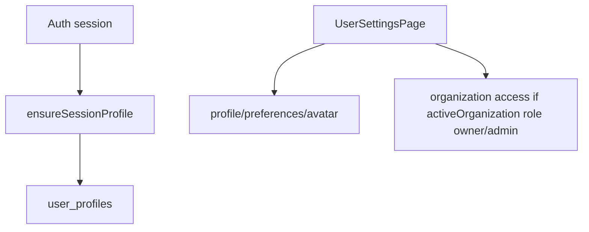

# Users

## Propósito

Users gestiona perfil, avatar, preferencias y ajustes de usuario. La ruta `/ajustes` monta `UserSettingsPage` con `userId`, `userEmail` y avatar del proveedor (`src/app/App.tsx:91`, `src/app/App.tsx:94`, `src/app/App.tsx:97`).

## Modelo de datos

El servicio de usuario define `UserPreferences` y `UserProfile` (`src/features/api/userService.ts:5`, `src/features/api/userService.ts:9`). Los perfiles se almacenan en `user_profiles`, y avatar de usuario usa bucket `avatars` (`src/features/api/userService.ts:23`, `src/features/api/userService.ts:65`).

## Ciclo de vida de las entidades

`AuthGate` llama `ensureSessionProfile` al aplicar sesión, lo que hace que el perfil exista antes de renderizar rutas privadas (`src/features/auth/AuthGate.tsx:7`, `src/features/auth/AuthGate.tsx:22`). Los ajustes de usuario consumen organización activa y permisos para mostrar manejo de organización; la UI considera admin si el rol es `owner` o `admin` (`src/features/users/components/UserSettingsPage.tsx:266`).

## Autorización

La UI de organización en ajustes depende de `activeOrganization.role`; solo owner/admin gestionan accesos de organización según condición local (`src/features/users/components/UserSettingsPage.tsx:266`). La autorización persistente de miembros vive en RLS de `organization_members` (`supabase/migrations/20260717081648_add_organizations.sql:146`, `supabase/migrations/20260717081648_add_organizations.sql:154`).

## Flujos principales

## Contratos externos

`getProviderAvatarUrl(session.user)` se usa para fallback visual en layout y ajustes (`src/app/App.tsx:14`, `src/app/App.tsx:24`, `src/app/App.tsx:97`). `UserAvatar` es el componente compartido para renderizar usuarios en otros módulos (`src/features/board/components/TaskEditorModal.tsx:25`).

## Errores y casos borde

No aplica con lo leído en detalle.

## Trampas

No asumas que todos los usuarios autenticados son visibles para asignación: asignaciones cargan miembros del proyecto o fallback del usuario actual, no una lista global abierta (`src/features/api/projectService.ts:566`, `src/features/api/projectService.ts:548`).

## Preguntas abiertas

No se leyó completo `userService.ts`; antes de cambiar avatar/preferencias, leer el archivo completo con líneas.
