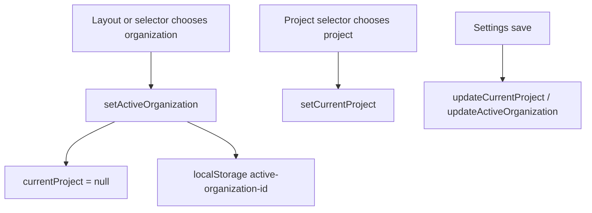

# Shared

## Propósito

`src/shared` contiene estado transversal, tipos y UI compartida entre features. `ProjectContext` centraliza organización activa, proyecto activo y listas de organizaciones (`src/shared/contexts/ProjectContext.tsx:5`).

## Modelo de datos

El contexto guarda `currentProject: ProjectWithTags | null`, `organizations: Organization[]` y `activeOrganization: Organization | null` (`src/shared/contexts/ProjectContext.tsx:6`, `src/shared/contexts/ProjectContext.tsx:9`, `src/shared/contexts/ProjectContext.tsx:11`). Los tipos de tablero compartidos son `Task`, `Column` y `BoardState` en `src/shared/types/board.ts:1`.

## Ciclo de vida de las entidades

El cambio de organización activa limpia `currentProject`, guarda `active-organization-id` en localStorage si hay organización y remueve esa key si no hay organización (`src/shared/contexts/ProjectContext.tsx:23`, `src/shared/contexts/ProjectContext.tsx:25`, `src/shared/contexts/ProjectContext.tsx:28`, `src/shared/contexts/ProjectContext.tsx:30`). `updateCurrentProject` mezcla updates parciales sobre el proyecto activo sin recargar desde Supabase (`src/shared/contexts/ProjectContext.tsx:34`).

## Autorización

No aplica como autorización persistente. `currentProject.can_edit` se calcula en `projectService.fetchProjects` a partir de membresía explícita y luego lo usan pantallas para deshabilitar mutaciones (`src/features/api/projectService.ts:235`, `src/features/api/projectService.ts:251`, `src/features/backlog/components/BacklogTable/BacklogTable.tsx:61`).

## Flujos principales

## Contratos externos

`useProject` debe ejecutarse dentro de `ProjectProvider`; si no, lanza `useProject must be used within ProjectProvider` (`src/shared/contexts/ProjectContext.tsx:75`, `src/shared/contexts/ProjectContext.tsx:78`). `shared/ui/WorkTable` expone shell, toolbar y row para tablas densas porque `BacklogTable` importa `WorkTableToolbar` (`src/features/backlog/components/BacklogTable/BacklogTable.tsx:32`).

## Errores y casos borde

No hay persistencia automática del proyecto activo en `ProjectContext`; solo se persiste organización activa (`src/shared/contexts/ProjectContext.tsx:28`).

## Trampas

No cambies `setActiveOrganization` para conservar `currentProject`: el código actual asume que cambiar organización invalida el proyecto seleccionado (`src/shared/contexts/ProjectContext.tsx:23`, `src/shared/contexts/ProjectContext.tsx:25`).

## Preguntas abiertas

No se verificó qué componente carga inicialmente `active-organization-id` desde localStorage.
