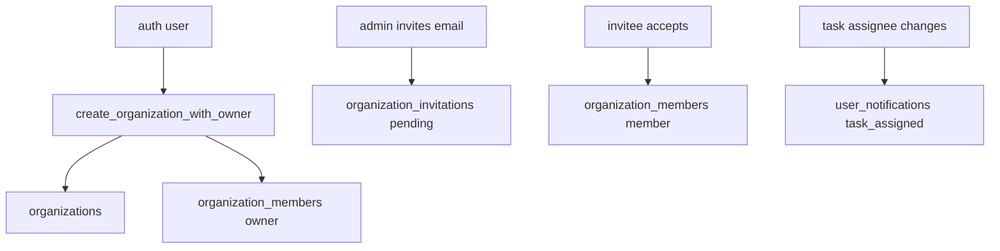

# Supabase Schema And Policies

## Propósito

Este directorio contiene migraciones locales que definen parte del esquema, RLS, RPCs, triggers, realtime y storage policies. La app cliente usa Supabase desde `src/lib/supabase.ts:16`.

## Modelo de datos

Las migraciones verificadas crean `roadmap_settings`, `task_dependencies`, `organizations`, `organization_members`, `organization_invitations` y `user_notifications` (`supabase/migrations/20260713130000_create_roadmap_settings.sql:1`, `supabase/migrations/20260713230522_create_task_dependencies.sql:1`, `supabase/migrations/20260717081648_add_organizations.sql:1`, `supabase/migrations/20260717081648_add_organizations.sql:10`, `supabase/migrations/20260717195219_organization_invitations_project_visibility.sql:29`, `supabase/migrations/20260717054718_task_assignment_notifications.sql:1`). Otras migraciones alteran tablas base existentes como `projects`, `epics`, `editor_notes`, `sprints`, `tasks`, `epic_dependencies` y `roadmap_settings` (`supabase/migrations/20260717081648_add_organizations.sql:161`, `supabase/migrations/20260714020248_cascade_project_epics_on_delete.sql:1`, `supabase/migrations/20260714020302_link_editor_notes_to_projects.sql:1`, `supabase/migrations/20260714015509_allow_open_sprints_with_start_date.sql:1`, `supabase/migrations/20260717055906_fix_task_assignment_realtime_notifications.sql:1`).

## Ciclo de vida de las entidades

`create_organization_with_owner` inserta organización y miembro owner en una función SQL (`supabase/migrations/20260717081648_add_organizations.sql:58`, `supabase/migrations/20260717081648_add_organizations.sql:77`, `supabase/migrations/20260717081648_add_organizations.sql:81`). `accept_organization_invitation` bloquea la invitación pendiente, verifica que `invitee_id = auth.uid()`, inserta miembro `member`, marca `accepted` y retorna organización (`supabase/migrations/20260717195219_organization_invitations_project_visibility.sql:78`, `supabase/migrations/20260717195219_organization_invitations_project_visibility.sql:88`, `supabase/migrations/20260717195219_organization_invitations_project_visibility.sql:99`, `supabase/migrations/20260717195219_organization_invitations_project_visibility.sql:103`, `supabase/migrations/20260717195219_organization_invitations_project_visibility.sql:107`). `create_task_assignment_notification` crea notificación si `assignee_id` no es null, cambió y no es el actor (`supabase/migrations/20260717055906_fix_task_assignment_realtime_notifications.sql:18`, `supabase/migrations/20260717055906_fix_task_assignment_realtime_notifications.sql:22`, `supabase/migrations/20260717055906_fix_task_assignment_realtime_notifications.sql:37`, `supabase/migrations/20260717055906_fix_task_assignment_realtime_notifications.sql:48`).

## Autorización

RLS se habilita explícitamente en organizaciones, miembros, invitaciones, notificaciones, task dependencies y roadmap settings (`supabase/migrations/20260717081648_add_organizations.sql:19`, `supabase/migrations/20260717195219_organization_invitations_project_visibility.sql:48`, `supabase/migrations/20260717054718_task_assignment_notifications.sql:17`, `supabase/migrations/20260713230522_create_task_dependencies.sql:15`, `supabase/migrations/20260713130000_create_roadmap_settings.sql:11`). Las funciones helper `is_organization_member`, `is_organization_admin` y `can_view_project` son base de las políticas de organización/proyecto (`supabase/migrations/20260717081648_add_organizations.sql:22`, `supabase/migrations/20260717081648_add_organizations.sql:37`, `supabase/migrations/20260717195219_organization_invitations_project_visibility.sql:5`).

## Flujos principales

## Contratos externos

Realtime publication incluye `project_invitations`, `organization_invitations`, `tasks` y `user_notifications` en migraciones leídas (`supabase/migrations/20260717051841_project_invitations_realtime.sql:282`, `supabase/migrations/20260717195219_organization_invitations_project_visibility.sql:431`, `supabase/migrations/20260717055906_fix_task_assignment_realtime_notifications.sql:80`, `supabase/migrations/20260717055906_fix_task_assignment_realtime_notifications.sql:90`). Storage policy de logos de organización permite administrar objetos en bucket `project-assets` bajo carpeta `organization-logos/{organizationId}` si `is_organization_admin` es true (`supabase/migrations/20260717084823_allow_organization_logos_storage.sql:3`, `supabase/migrations/20260717084823_allow_organization_logos_storage.sql:8`, `supabase/migrations/20260717084823_allow_organization_logos_storage.sql:10`).

## Errores y casos borde

La migración de un solo sprint activo re-clasifica activos sobrantes a `future` y luego crea índice único parcial (`supabase/migrations/20260722002522_enforce_single_active_sprint.sql:1`, `supabase/migrations/20260722002522_enforce_single_active_sprint.sql:11`, `supabase/migrations/20260722002522_enforce_single_active_sprint.sql:21`). Los triggers de dependencias levantan excepción si una dependencia crearía ciclo (`supabase/migrations/20260717030110_prevent_roadmap_dependency_cycles.sql:31`, `supabase/migrations/20260717030110_prevent_roadmap_dependency_cycles.sql:73`).

## Trampas

No uses estas migraciones como schema completo; faltan creaciones base de varias tablas que los servicios consumen. No cambies helper functions sin revisar políticas que dependen de ellas, porque `can_view_project` se usa para projects, project_members, tags, columns, sprints, tasks, epics, notes y roadmap settings (`supabase/migrations/20260717195219_organization_invitations_project_visibility.sql:157`, `supabase/migrations/20260717195219_organization_invitations_project_visibility.sql:210`, `supabase/migrations/20260717195219_organization_invitations_project_visibility.sql:220`, `supabase/migrations/20260717195219_organization_invitations_project_visibility.sql:226`, `supabase/migrations/20260717195219_organization_invitations_project_visibility.sql:241`, `supabase/migrations/20260717195219_organization_invitations_project_visibility.sql:248`, `supabase/migrations/20260717195219_organization_invitations_project_visibility.sql:255`, `supabase/migrations/20260717195219_organization_invitations_project_visibility.sql:262`, `supabase/migrations/20260717195219_organization_invitations_project_visibility.sql:269`).

## Preguntas abiertas

El estado remoto puede tener migraciones aplicadas que no están representadas localmente. No se verificó el dashboard ni se ejecutaron queries contra Supabase en esta tarea.
