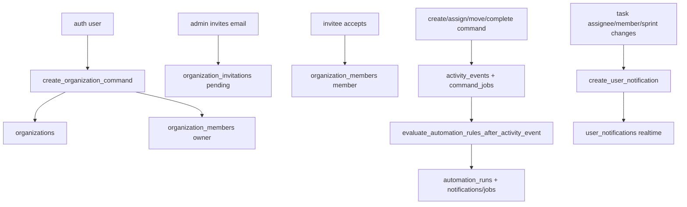

# Supabase Schema And Policies

## Propósito

Este directorio contiene migraciones locales que definen parte del esquema, RLS, RPCs, triggers, realtime y storage policies. La app cliente usa Supabase desde `src/lib/supabase.ts:16`.

## Modelo de datos

Las migraciones verificadas crean `roadmap_settings`, `task_dependencies`, `organizations`, `organization_members`, `organization_invitations`, `user_notifications`, `activity_events` y `command_jobs` (`supabase/migrations/20260713130000_create_roadmap_settings.sql:1`, `supabase/migrations/20260713230522_create_task_dependencies.sql:1`, `supabase/migrations/20260717081648_add_organizations.sql:1`, `supabase/migrations/20260717081648_add_organizations.sql:10`, `supabase/migrations/20260717195219_organization_invitations_project_visibility.sql:29`, `supabase/migrations/20260717054718_task_assignment_notifications.sql:1`, `supabase/migrations/20260729215527_critical_task_sprint_commands.sql:1`, `supabase/migrations/20260729215527_critical_task_sprint_commands.sql:31`). Otras migraciones alteran tablas base existentes como `projects`, `epics`, `editor_notes`, `sprints`, `tasks`, `epic_dependencies` y `roadmap_settings` (`supabase/migrations/20260717081648_add_organizations.sql:161`, `supabase/migrations/20260714020248_cascade_project_epics_on_delete.sql:1`, `supabase/migrations/20260714020302_link_editor_notes_to_projects.sql:1`, `supabase/migrations/20260714015509_allow_open_sprints_with_start_date.sql:1`, `supabase/migrations/20260717055906_fix_task_assignment_realtime_notifications.sql:1`).

`command_jobs` empezó como outbox de commands y ahora también es la frontera de cola de trabajo. `command_job_worker_foundation` agrega `max_attempts`, `locked_at`, `locked_by`, `job_key`, `updated_at`, índices de claim/lock/idempotencia y reemplaza `enqueue_command_job` para escribir siempre una fila durable con `job_key` opcional (`supabase/migrations/20260730045659_command_job_worker_foundation.sql:1`, `supabase/migrations/20260730045659_command_job_worker_foundation.sql:12`, `supabase/migrations/20260730045659_command_job_worker_foundation.sql:16`, `supabase/migrations/20260730045659_command_job_worker_foundation.sql:20`, `supabase/migrations/20260730045659_command_job_worker_foundation.sql:24`). Esa tabla es el contrato local de trabajos async para actividad, notificaciones, emails, reportes y procesamiento; no debe tratarse como una cola exclusiva de Supabase porque existe una feature futura para cambiar el transporte a un broker open source tipo Kafka en servidor propio.

`scheduled_maintenance_cron` instala `pg_cron`, amplía los tipos permitidos de `user_notifications`, define `run_command_job_maintenance` para limpiar locks vencidos de `command_jobs` y define `scan_sprint_deadlines` para detectar sprints activos que vencen mañana o ya vencieron (`supabase/migrations/20260730053934_scheduled_maintenance_cron.sql:1`, `supabase/migrations/20260730053934_scheduled_maintenance_cron.sql:14`, `supabase/migrations/20260730053934_scheduled_maintenance_cron.sql:19`, `supabase/migrations/20260730053934_scheduled_maintenance_cron.sql:45`). La función de deadline crea notificaciones `sprint_due_soon` con dedupe por sprint/usuario y `sprint_overdue` con dedupe por sprint/usuario/día; no modifica `sprints.status` ni ejecuta cierre de sprint (`supabase/migrations/20260730053934_scheduled_maintenance_cron.sql:80`, `supabase/migrations/20260730053934_scheduled_maintenance_cron.sql:94`, `supabase/migrations/20260730053934_scheduled_maintenance_cron.sql:123`, `supabase/migrations/20260730053934_scheduled_maintenance_cron.sql:138`). `allow_sprint_deadline_notification_types` reemplaza `create_user_notification` para que su allowlist interna acepte esos dos tipos sin conceder ejecución al cliente (`supabase/migrations/20260730054111_allow_sprint_deadline_notification_types.sql:1`, `supabase/migrations/20260730054111_allow_sprint_deadline_notification_types.sql:42`, `supabase/migrations/20260730054111_allow_sprint_deadline_notification_types.sql:126`).

`automation_rules` y `automation_runs` son la base de automatizaciones premium. Cada regla pertenece a una organización y a un proyecto, tiene `trigger_event`, `conditions` JSONB, `actions` JSONB, estado `enabled`, creador y `last_run_at`; cada ejecución guarda el evento de actividad, estado, contadores y resultado/error (`supabase/migrations/20260730055853_premium_automation_rules.sql:1`, `supabase/migrations/20260730055853_premium_automation_rules.sql:21`). Las tablas tienen RLS y realtime publication, de modo que el frontend puede configurar reglas y mostrar historial, pero la ejecución nace en SQL (`supabase/migrations/20260730055853_premium_automation_rules.sql:51`, `supabase/migrations/20260730055853_premium_automation_rules.sql:54`, `supabase/migrations/20260730055853_premium_automation_rules.sql:99`, `supabase/migrations/20260730055853_premium_automation_rules.sql:475`, `supabase/migrations/20260730055853_premium_automation_rules.sql:485`).

## Ciclo de vida de las entidades

`create_organization_command` inserta organización, owner, activity event y outbox en una transacción; `create_project_command` inserta proyecto, owner, tags, columnas, column order, activity event y outbox en una transacción (`supabase/migrations/20260730033038_workspace_transaction_commands.sql:1`, `supabase/migrations/20260730033038_workspace_transaction_commands.sql:23`, `supabase/migrations/20260730033038_workspace_transaction_commands.sql:26`, `supabase/migrations/20260730033038_workspace_transaction_commands.sql:28`, `supabase/migrations/20260730033038_workspace_transaction_commands.sql:54`, `supabase/migrations/20260730033038_workspace_transaction_commands.sql:144`, `supabase/migrations/20260730033038_workspace_transaction_commands.sql:154`, `supabase/migrations/20260730033038_workspace_transaction_commands.sql:165`, `supabase/migrations/20260730033038_workspace_transaction_commands.sql:183`). `create_organization_invitation_command`, `accept_organization_invitation_command`, `add_project_member_command` y `remove_organization_member_command` centralizan validación de admin/owner, bloqueo de filas, unique pending invitations, last-owner guard, eliminación de accesos de proyecto al remover de organización, eventos y outbox (`supabase/migrations/20260730033038_workspace_transaction_commands.sql:200`, `supabase/migrations/20260730033038_workspace_transaction_commands.sql:359`, `supabase/migrations/20260730033038_workspace_transaction_commands.sql:579`, `supabase/migrations/20260730033038_workspace_transaction_commands.sql:661`). `create_task_command` valida proyecto, épica, responsable, columna/sprint, incrementa `projects.task_sequence`, genera `task_id_display`, inserta `tasks`, registra `activity_events` y encola outbox (`supabase/migrations/20260729215527_critical_task_sprint_commands.sql:158`, `supabase/migrations/20260729215527_critical_task_sprint_commands.sql:180`, `supabase/migrations/20260729215527_critical_task_sprint_commands.sql:189`, `supabase/migrations/20260729215527_critical_task_sprint_commands.sql:208`, `supabase/migrations/20260729215527_critical_task_sprint_commands.sql:234`, `supabase/migrations/20260729215527_critical_task_sprint_commands.sql:242`, `supabase/migrations/20260729215527_critical_task_sprint_commands.sql:278`, `supabase/migrations/20260729215527_critical_task_sprint_commands.sql:301`). `assign_task_command` bloquea la tarea, valida miembro de proyecto, actualiza `assignee_id`, registra evento y encola job si cambió el responsable (`supabase/migrations/20260729215527_critical_task_sprint_commands.sql:351`, `supabase/migrations/20260729215527_critical_task_sprint_commands.sql:362`, `supabase/migrations/20260729215527_critical_task_sprint_commands.sql:371`, `supabase/migrations/20260729215527_critical_task_sprint_commands.sql:379`, `supabase/migrations/20260729215527_critical_task_sprint_commands.sql:403`). `move_task_column_command` bloquea la tarea, valida `can_mutate_project`, valida que la columna destino pertenezca al proyecto, actualiza `column_id`, `position`, `in_backlog=false` y registra `task.moved` con `record_activity_event` (`supabase/migrations/20260730042301_move_task_column_command.sql:1`, `supabase/migrations/20260730042301_move_task_column_command.sql:18`, `supabase/migrations/20260730042301_move_task_column_command.sql:36`, `supabase/migrations/20260730042301_move_task_column_command.sql:45`, `supabase/migrations/20260730042301_move_task_column_command.sql:66`, `supabase/migrations/20260730042301_move_task_column_command.sql:89`). `complete_sprint_command` bloquea el sprint activo, exige una decisión para cada tarea incompleta, mueve incompletas a backlog o sprint futuro y cierra el sprint en una transacción (`supabase/migrations/20260729215527_critical_task_sprint_commands.sql:462`, `supabase/migrations/20260729215527_critical_task_sprint_commands.sql:473`, `supabase/migrations/20260729215527_critical_task_sprint_commands.sql:487`, `supabase/migrations/20260729215527_critical_task_sprint_commands.sql:522`, `supabase/migrations/20260729215527_critical_task_sprint_commands.sql:555`, `supabase/migrations/20260729215527_critical_task_sprint_commands.sql:584`, `supabase/migrations/20260729215527_critical_task_sprint_commands.sql:598`). La migración `centralize_activity_events` agrega `event_key`, índices de consulta, la función `record_activity_event` y el trigger `normalize_activity_event_before_insert`; el trigger cubre los inserts directos existentes y la función es el contrato que deben usar commands nuevos (`supabase/migrations/20260730035602_centralize_activity_events.sql:1`, `supabase/migrations/20260730035602_centralize_activity_events.sql:4`, `supabase/migrations/20260730035602_centralize_activity_events.sql:7`, `supabase/migrations/20260730035602_centralize_activity_events.sql:10`, `supabase/migrations/20260730035602_centralize_activity_events.sql:14`, `supabase/migrations/20260730035602_centralize_activity_events.sql:128`, `supabase/migrations/20260730035602_centralize_activity_events.sql:134`). `server_side_notifications` amplía `user_notifications` con `organization_id`, `payload`, `dedupe_key` y tipos controlados; `create_user_notification` es la fábrica central, y triggers SQL crean notificaciones por asignación, acceso a proyecto, acceso a organización y cierre de sprint (`supabase/migrations/20260730041047_server_side_notifications.sql:1`, `supabase/migrations/20260730041047_server_side_notifications.sql:10`, `supabase/migrations/20260730041047_server_side_notifications.sql:36`, `supabase/migrations/20260730041047_server_side_notifications.sql:198`, `supabase/migrations/20260730041047_server_side_notifications.sql:229`, `supabase/migrations/20260730041047_server_side_notifications.sql:272`, `supabase/migrations/20260730041047_server_side_notifications.sql:315`).

Los jobs async se crean con `enqueue_command_job`, se reclaman con `claim_command_jobs`, terminan con `complete_command_job`, fallan con retry mediante `fail_command_job` y los locks vencidos se devuelven con `reset_stale_command_jobs` (`supabase/migrations/20260730045659_command_job_worker_foundation.sql:24`, `supabase/migrations/20260730045659_command_job_worker_foundation.sql:73`, `supabase/migrations/20260730045659_command_job_worker_foundation.sql:118`, `supabase/migrations/20260730045659_command_job_worker_foundation.sql:158`, `supabase/migrations/20260730045659_command_job_worker_foundation.sql:200`). `claim_command_jobs` usa `for update skip locked`, ordena por `available_at`/`created_at`, limita lotes a 50 y solo reclama filas `queued`/`failed` con intentos disponibles (`supabase/migrations/20260730045659_command_job_worker_foundation.sql:87`, `supabase/migrations/20260730045659_command_job_worker_foundation.sql:93`, `supabase/migrations/20260730045659_command_job_worker_foundation.sql:96`, `supabase/migrations/20260730045659_command_job_worker_foundation.sql:97`).

Los cron jobs registrados son `nexusplanner-command-job-maintenance`, que corre `select public.run_command_job_maintenance(300);` cada cinco minutos, y `nexusplanner-sprint-deadline-scan`, que corre `select public.scan_sprint_deadlines(current_date);` una vez al día (`supabase/migrations/20260730053934_scheduled_maintenance_cron.sql:179`, `supabase/migrations/20260730053934_scheduled_maintenance_cron.sql:182`, `supabase/migrations/20260730053934_scheduled_maintenance_cron.sql:185`, `supabase/migrations/20260730053934_scheduled_maintenance_cron.sql:188`). Ambos jobs invocan funciones SQL internas; la invocación HTTP de `job-worker` desde cron queda pendiente hasta configurar Vault/secretos para no acoplar secretos operativos al frontend ni a migraciones inseguras.

Una automatización vive así: el usuario configura una regla desde Project Settings, Supabase persiste la regla, un command de producto inserta `activity_events`, el trigger `evaluate_automation_rules_after_activity_event` busca reglas habilitadas del mismo proyecto, `automation_rule_matches_event` evalúa trigger y condiciones, se inserta un `automation_runs` y `execute_automation_action` ejecuta cada acción (`src/features/projects/components/ProjectSettingsModal.tsx:360`, `src/features/api/automationService.ts:112`, `supabase/migrations/20260730055853_premium_automation_rules.sql:201`, `supabase/migrations/20260730055853_premium_automation_rules.sql:239`, `supabase/migrations/20260730055853_premium_automation_rules.sql:347`, `supabase/migrations/20260730055853_premium_automation_rules.sql:462`). Las acciones verificadas crean notificaciones `automation_rule` para owners o actor, o encolan jobs `automation.email` y `automation.webhook`; `job-worker` reconoce `automation.*` como tipo futuro/no-op server-side (`supabase/migrations/20260730055853_premium_automation_rules.sql:271`, `supabase/migrations/20260730055853_premium_automation_rules.sql:299`, `supabase/migrations/20260730055853_premium_automation_rules.sql:323`, `supabase/migrations/20260730055853_premium_automation_rules.sql:335`, `supabase/functions/job-worker/index.ts:159`).

`task.created` debe entregar un snapshot suficiente para condiciones de automatización. `enrich_task_created_event_payload` reemplaza `create_task_command` para incluir `destination`, `column_id`, `sprint_id`, `issue_type_id`, `priority_id`, `story_points`, `assignee_id`, `epic_id`, `is_unassigned` e `in_backlog` en `activity_events.payload`; esto evita que una regla tenga que leer `tasks` después de que el usuario haya editado la tarea (`supabase/migrations/20260730061644_enrich_task_created_event_payload.sql:168`, `supabase/migrations/20260730061644_enrich_task_created_event_payload.sql:172`, `supabase/migrations/20260730061644_enrich_task_created_event_payload.sql:177`, `supabase/migrations/20260730061644_enrich_task_created_event_payload.sql:178`, `supabase/migrations/20260730061644_enrich_task_created_event_payload.sql:179`, `supabase/migrations/20260730061644_enrich_task_created_event_payload.sql:180`, `supabase/migrations/20260730061644_enrich_task_created_event_payload.sql:181`, `supabase/migrations/20260730061644_enrich_task_created_event_payload.sql:182`, `supabase/migrations/20260730061644_enrich_task_created_event_payload.sql:183`, `supabase/migrations/20260730061644_enrich_task_created_event_payload.sql:184`, `supabase/migrations/20260730061644_enrich_task_created_event_payload.sql:185`).

## Autorización

RLS se habilita explícitamente en organizaciones, miembros, invitaciones, notificaciones, activity events, command jobs, task dependencies y roadmap settings (`supabase/migrations/20260717081648_add_organizations.sql:19`, `supabase/migrations/20260717195219_organization_invitations_project_visibility.sql:48`, `supabase/migrations/20260717054718_task_assignment_notifications.sql:17`, `supabase/migrations/20260729215527_critical_task_sprint_commands.sql:19`, `supabase/migrations/20260729215527_critical_task_sprint_commands.sql:48`, `supabase/migrations/20260713230522_create_task_dependencies.sql:15`, `supabase/migrations/20260713130000_create_roadmap_settings.sql:11`). La capa canónica de autorización SQL vive en `centralized_sql_permissions`: `current_organization_role` y `current_project_role` resuelven el rol del usuario autenticado; `can_view_organization`, `can_manage_organization`, `can_create_project_in_organization`, `can_view_project`, `can_mutate_project`, `can_manage_project`, `can_add_project_member`, `can_invite_to_organization`, `can_invite_to_project` y `can_assign_project_user` son las funciones que deben consumir nuevas policies y commands (`supabase/migrations/20260730034117_centralized_sql_permissions.sql:1`, `supabase/migrations/20260730034117_centralized_sql_permissions.sql:15`, `supabase/migrations/20260730034117_centralized_sql_permissions.sql:29`, `supabase/migrations/20260730034117_centralized_sql_permissions.sql:39`, `supabase/migrations/20260730034117_centralized_sql_permissions.sql:49`, `supabase/migrations/20260730034117_centralized_sql_permissions.sql:59`, `supabase/migrations/20260730034117_centralized_sql_permissions.sql:80`, `supabase/migrations/20260730034117_centralized_sql_permissions.sql:90`, `supabase/migrations/20260730034117_centralized_sql_permissions.sql:100`, `supabase/migrations/20260730034117_centralized_sql_permissions.sql:130`, `supabase/migrations/20260730034117_centralized_sql_permissions.sql:140`, `supabase/migrations/20260730034117_centralized_sql_permissions.sql:153`). Las funciones legacy `is_organization_member`, `is_organization_admin`, `is_project_member`, `is_project_owner` y `can_edit_project` siguen existiendo como wrappers para compatibilidad, por lo que no deben bifurcar reglas propias (`supabase/migrations/20260730034117_centralized_sql_permissions.sql:172`, `supabase/migrations/20260730034117_centralized_sql_permissions.sql:182`, `supabase/migrations/20260730034117_centralized_sql_permissions.sql:192`, `supabase/migrations/20260730034117_centralized_sql_permissions.sql:202`, `supabase/migrations/20260730034117_centralized_sql_permissions.sql:212`). `activity_events` se lee con `can_view_project` cuando tiene proyecto y con `can_view_organization` cuando es evento solo de organización; `record_activity_event` y su trigger no son APIs de frontend porque se revoca `execute` a `anon`/`authenticated` (`supabase/migrations/20260730035602_centralize_activity_events.sql:183`, `supabase/migrations/20260730035602_centralize_activity_events.sql:187`). Los commands `SECURITY DEFINER` revocan `PUBLIC`/`anon` y solo exponen ejecución a `authenticated`; `enqueue_command_job` queda cerrado al cliente porque solo debe invocarse desde otras funciones SQL (`supabase/migrations/20260729215934_harden_command_rpc_privileges.sql:1`, `supabase/migrations/20260729215934_harden_command_rpc_privileges.sql:4`, `supabase/migrations/20260729215934_harden_command_rpc_privileges.sql:6`, `supabase/migrations/20260729215934_harden_command_rpc_privileges.sql:9`, `supabase/migrations/20260729215934_harden_command_rpc_privileges.sql:12`). Los RPCs de worker `claim_command_jobs`, `complete_command_job`, `fail_command_job` y `reset_stale_command_jobs` también quedan sin `execute` para `anon`/`authenticated`; solo deben usarse desde Edge Function con service role o desde backend autorizado (`supabase/migrations/20260730045659_command_job_worker_foundation.sql:114`, `supabase/migrations/20260730045659_command_job_worker_foundation.sql:154`, `supabase/migrations/20260730045659_command_job_worker_foundation.sql:196`, `supabase/migrations/20260730045659_command_job_worker_foundation.sql:227`).

Los RPCs cron `run_command_job_maintenance` y `scan_sprint_deadlines` también son internos y quedan sin `execute` para `anon`/`authenticated` (`supabase/migrations/20260730053934_scheduled_maintenance_cron.sql:41`, `supabase/migrations/20260730053934_scheduled_maintenance_cron.sql:42`, `supabase/migrations/20260730053934_scheduled_maintenance_cron.sql:43`, `supabase/migrations/20260730053934_scheduled_maintenance_cron.sql:155`, `supabase/migrations/20260730053934_scheduled_maintenance_cron.sql:156`, `supabase/migrations/20260730053934_scheduled_maintenance_cron.sql:157`). No los llames desde servicios frontend: el cliente ya recibe el resultado indirectamente por `user_notifications` realtime y por el estado de jobs procesados.

Las policies de `automation_rules` permiten lectura con `can_view_project` y escritura solo con `can_manage_project`, además de validar que `project.organization_id` coincida con `automation_rules.organization_id`; `automation_runs` solo concede lectura con `can_view_project` (`supabase/migrations/20260730055853_premium_automation_rules.sql:54`, `supabase/migrations/20260730055853_premium_automation_rules.sql:61`, `supabase/migrations/20260730055853_premium_automation_rules.sql:76`, `supabase/migrations/20260730055853_premium_automation_rules.sql:92`, `supabase/migrations/20260730055853_premium_automation_rules.sql:99`). Las funciones de matching/ejecución/evaluación son `SECURITY DEFINER` internas y revocan ejecución a `PUBLIC`, `anon` y `authenticated`; no deben convertirse en RPCs públicas (`supabase/migrations/20260730055853_premium_automation_rules.sql:543`, `supabase/migrations/20260730055853_premium_automation_rules.sql:546`, `supabase/migrations/20260730055853_premium_automation_rules.sql:549`).

## Flujos principales

## Contratos externos

Realtime publication incluye `project_invitations`, `organization_invitations`, `tasks`, `user_notifications` y `activity_events` en migraciones leídas (`supabase/migrations/20260717051841_project_invitations_realtime.sql:282`, `supabase/migrations/20260717195219_organization_invitations_project_visibility.sql:431`, `supabase/migrations/20260717055906_fix_task_assignment_realtime_notifications.sql:80`, `supabase/migrations/20260717055906_fix_task_assignment_realtime_notifications.sql:90`, `supabase/migrations/20260729215527_critical_task_sprint_commands.sql:636`, `supabase/migrations/20260730041047_server_side_notifications.sql:374`). Storage policy de logos de organización permite administrar objetos en bucket `project-assets` bajo carpeta `organization-logos/{organizationId}` si `is_organization_admin` es true (`supabase/migrations/20260717084823_allow_organization_logos_storage.sql:3`, `supabase/migrations/20260717084823_allow_organization_logos_storage.sql:8`, `supabase/migrations/20260717084823_allow_organization_logos_storage.sql:10`). Edge Function wrappers `task-commands` y `sprint-commands` pasan el JWT del usuario a las RPCs y no duplican reglas de negocio (`supabase/functions/task-commands/index.ts:20`, `supabase/functions/task-commands/index.ts:25`, `supabase/functions/task-commands/index.ts:34`, `supabase/functions/sprint-commands/index.ts:20`, `supabase/functions/sprint-commands/index.ts:25`, `supabase/functions/sprint-commands/index.ts:36`).

`job-worker` es la Edge Function que procesa la cola local: exige `JOB_WORKER_SECRET` y `x-job-worker-secret`, crea cliente con `SUPABASE_SERVICE_ROLE_KEY`, resetea locks vencidos, reclama jobs con `claim_command_jobs`, marca completados con `complete_command_job` y reprograma fallos con `fail_command_job` (`supabase/functions/job-worker/index.ts:53`, `supabase/functions/job-worker/index.ts:54`, `supabase/functions/job-worker/index.ts:72`, `supabase/functions/job-worker/index.ts:83`, `supabase/functions/job-worker/index.ts:91`, `supabase/functions/job-worker/index.ts:107`, `supabase/functions/job-worker/index.ts:120`). CORS permite `x-job-worker-secret` para invocación server-side programada (`supabase/functions/_shared/cors.ts:3`). `report.sprint_completed` es un job reconocido para post-procesamiento de reportes ya persistidos, y `metrics.sprint_completed` queda reconocido por compatibilidad con jobs antiguos (`supabase/functions/job-worker/index.ts:24`, `supabase/functions/job-worker/index.ts:37`).

`automation.email` y `automation.webhook` son contratos de cola para automatizaciones, no envíos reales todavía. `execute_automation_action` los encola con `enqueue_command_job` y `job-worker` los acepta como `automation.*`; la integración final con proveedor de email, webhook signer o broker externo debe vivir detrás de `job-worker`, no en React (`supabase/migrations/20260730055853_premium_automation_rules.sql:323`, `supabase/migrations/20260730055853_premium_automation_rules.sql:335`, `supabase/functions/job-worker/index.ts:159`).

`sprint_reports` persiste reportes backend de cierre de sprint con totales, porcentajes, story points y snapshot JSON de tareas, totales por status y decisiones sobre incompletas (`supabase/migrations/20260730052854_backend_sprint_reports.sql:1`, `supabase/migrations/20260730052854_backend_sprint_reports.sql:22`, `supabase/migrations/20260730052854_backend_sprint_reports.sql:301`). La tabla solo concede `select` a usuarios autenticados y RLS usa `can_view_project`; `generate_sprint_report` y `story_points_to_number` no son ejecutables por `anon`/`authenticated` (`supabase/migrations/20260730052854_backend_sprint_reports.sql:41`, `supabase/migrations/20260730052854_backend_sprint_reports.sql:50`, `supabase/migrations/20260730052854_backend_sprint_reports.sql:64`, `supabase/migrations/20260730052854_backend_sprint_reports.sql:334`). `complete_sprint_command` genera el reporte antes de mover tareas incompletas para que el snapshot histórico no dependa del estado vivo posterior; `normalize_sprint_report_before_write` fuerza `sprint_status` y `snapshot.sprint.status` a `closed` cuando el reporte tiene `closed_at` (`supabase/migrations/20260730052854_backend_sprint_reports.sql:338`, `supabase/migrations/20260730052854_backend_sprint_reports.sql:455`, `supabase/migrations/20260730052854_backend_sprint_reports.sql:552`, `supabase/migrations/20260730053303_fix_sprint_report_closed_status.sql:1`, `supabase/migrations/20260730053303_fix_sprint_report_closed_status.sql:9`, `supabase/migrations/20260730053303_fix_sprint_report_closed_status.sql:10`).

## Errores y casos borde

La migración de un solo sprint activo re-clasifica activos sobrantes a `future` y luego crea índice único parcial (`supabase/migrations/20260722002522_enforce_single_active_sprint.sql:1`, `supabase/migrations/20260722002522_enforce_single_active_sprint.sql:11`, `supabase/migrations/20260722002522_enforce_single_active_sprint.sql:21`). Los triggers de dependencias levantan excepción si una dependencia crearía ciclo (`supabase/migrations/20260717030110_prevent_roadmap_dependency_cycles.sql:31`, `supabase/migrations/20260717030110_prevent_roadmap_dependency_cycles.sql:73`).

`enqueue_command_job` es idempotente solo cuando el payload trae `job_key`; sin `job_key`, cada llamada crea una fila nueva (`supabase/migrations/20260730045659_command_job_worker_foundation.sql:12`, `supabase/migrations/20260730045659_command_job_worker_foundation.sql:36`, `supabase/migrations/20260730045659_command_job_worker_foundation.sql:61`). Un job `failed` vuelve a ser reclamable mientras `attempts < max_attempts`; cuando llega al límite permanece fallido para inspección manual (`supabase/migrations/20260730045659_command_job_worker_foundation.sql:93`, `supabase/migrations/20260730045659_command_job_worker_foundation.sql:95`, `supabase/migrations/20260730045659_command_job_worker_foundation.sql:158`).

## Trampas

No uses estas migraciones como schema completo; faltan creaciones base de varias tablas que los servicios consumen. No agregues checks de rol directamente dentro de policies o RPCs nuevas si el concepto puede centralizarse en una función `can_*`; `can_view_project` se usa para projects, project_members, tags, columns, sprints, tasks, epics, notes y roadmap settings, y ahora pertenece a la capa canónica de permisos (`supabase/migrations/20260717195219_organization_invitations_project_visibility.sql:157`, `supabase/migrations/20260717195219_organization_invitations_project_visibility.sql:210`, `supabase/migrations/20260717195219_organization_invitations_project_visibility.sql:220`, `supabase/migrations/20260717195219_organization_invitations_project_visibility.sql:226`, `supabase/migrations/20260717195219_organization_invitations_project_visibility.sql:241`, `supabase/migrations/20260717195219_organization_invitations_project_visibility.sql:248`, `supabase/migrations/20260717195219_organization_invitations_project_visibility.sql:255`, `supabase/migrations/20260717195219_organization_invitations_project_visibility.sql:262`, `supabase/migrations/20260717195219_organization_invitations_project_visibility.sql:269`, `supabase/migrations/20260730034117_centralized_sql_permissions.sql:59`).

No vuelvas a implementar creación de tareas, asignación de responsables, cambio de columna/estado, cierre de sprint, creación de organización/proyecto, invitaciones o cambios de miembros como múltiples escrituras del frontend. Esos flujos deben pasar por `create_task_command`, `assign_task_command`, `move_task_column_command`, `complete_sprint_command` y los commands de workspace; los wrappers Edge existen para API server-side, pero la autoridad sigue en las RPCs (`supabase/migrations/20260729215527_critical_task_sprint_commands.sql:123`, `supabase/migrations/20260729215527_critical_task_sprint_commands.sql:318`, `supabase/migrations/20260730042301_move_task_column_command.sql:1`, `supabase/migrations/20260729215527_critical_task_sprint_commands.sql:422`, `supabase/migrations/20260730033038_workspace_transaction_commands.sql:1`, `supabase/migrations/20260730033038_workspace_transaction_commands.sql:54`, `supabase/migrations/20260730033038_workspace_transaction_commands.sql:200`, `supabase/functions/task-commands/index.ts:34`, `supabase/functions/sprint-commands/index.ts:36`, `supabase/functions/workspace-commands/index.ts:70`). No agregues inserts directos nuevos a `activity_events`; usa `record_activity_event`, porque el trigger es red de seguridad para código heredado y no el contrato preferido (`supabase/migrations/20260730035602_centralize_activity_events.sql:128`, `supabase/migrations/20260730035602_centralize_activity_events.sql:134`). No agregues inserts directos nuevos a `user_notifications`; usa `create_user_notification` o un trigger SQL server-side, porque el frontend solo debe leer/marcar leídas (`supabase/migrations/20260730041047_server_side_notifications.sql:36`, `src/features/api/notificationService.ts:23`, `src/features/api/notificationService.ts:40`).

No llames `claim_command_jobs`, `complete_command_job`, `fail_command_job` ni `reset_stale_command_jobs` desde el frontend. La frontera permitida es: command SQL encola, worker server-side procesa. La feature futura de broker Kafka-compatible debe conservar ese contrato para que emails/reportes/procesamiento no dependan de componentes React ni de hooks (`supabase/migrations/20260730045659_command_job_worker_foundation.sql:73`, `supabase/migrations/20260730045659_command_job_worker_foundation.sql:118`, `supabase/migrations/20260730045659_command_job_worker_foundation.sql:158`, `supabase/migrations/20260730045659_command_job_worker_foundation.sql:200`, `supabase/functions/job-worker/index.ts:87`).

No agregues cron que cierre sprints automáticamente. El cron de deadlines solo notifica; el cierre debe seguir pasando por `complete_sprint_command` porque esa RPC exige decisiones por tarea incompleta, genera reporte y mueve tareas en una transacción (`supabase/migrations/20260730053934_scheduled_maintenance_cron.sql:45`, `supabase/migrations/20260729215527_critical_task_sprint_commands.sql:487`, `supabase/migrations/20260729215527_critical_task_sprint_commands.sql:522`, `supabase/migrations/20260730052854_backend_sprint_reports.sql:455`).

No agregues automatizaciones que actualicen `tasks`, `sprints` o `project_members` directamente dentro de `execute_automation_action` sin un diseño explícito de idempotencia, dedupe y prevención de loops. Cada automatización se dispara por `activity_events`; si una acción crea otro evento que vuelve a coincidir con la misma regla, el sistema puede encadenarse sin límite (`supabase/migrations/20260730055853_premium_automation_rules.sql:347`, `supabase/migrations/20260730055853_premium_automation_rules.sql:376`, `supabase/migrations/20260730055853_premium_automation_rules.sql:415`).

## Preguntas abiertas

El estado remoto puede tener migraciones aplicadas que no están representadas localmente. No se verificó el dashboard ni se ejecutaron queries contra Supabase en esta tarea.
